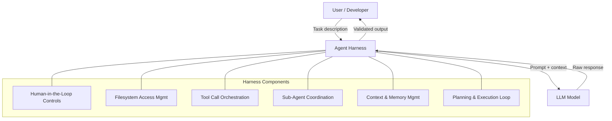

# Agent Harnesses in 2026: Why the Wrapper Matters More Than the Model

2025 was the year everyone built [AI agents](/glossary/ai-agent). 2026 is the year we figure out how to make them actually work. The difference isn't better models — it's better **agent harnesses**, the orchestration layer that wraps around a model to handle approvals, tool calls, filesystem access, and error recovery. **[Claude Code](/blog/claude-code-complete-guide)** didn't break out because Claude got smarter. It broke out because Anthropic built a better harness. If you're still optimizing which model to use, you're solving the wrong problem.

## What Happened

The term **[agent harness](/blog/effective-harnesses-for-long-running-agents)** has emerged as the industry's way of describing the scaffolding that turns a raw language model into a reliable autonomous system. Think of the model as an engine and the harness as the car — the best engine in the world goes nowhere useful without steering, brakes, and a chassis.

An agent harness manages everything the model can't: human-in-the-loop approvals, sub-agent coordination, filesystem permissions, prompt presets, lifecycle hooks, and planning/execution flow. The model generates responses. The harness decides what happens with them.

This isn't theoretical. Three companies demonstrated the pattern in concrete terms during late 2025 and early 2026:

- **Manus** rewrote their harness architecture five times in six months while using the same underlying models. Each rewrite improved reliability and task completion rates. The variable that changed was always the harness, never the model.
- **[LangChain](/blog/coding-agents-reshaping-epd)** re-architected their Deep Research agent four times in one year. Better workflow structures and sub-task coordination drove improvements, not model upgrades.
- **Vercel** removed 80% of their agent's available tools and saw *better* results — fewer steps, fewer tokens, faster responses, higher success rates. Improvement through harness simplification.

Anthropic's own [computer use](https://www.anthropic.com/news/3-5-models-and-computer-use) feature follows the same pattern: the model generates actions, but the harness controls what's allowed, validates outputs, and manages human intervention points.

## Why It Matters

The strategic implication is stark: **models are commoditizing, harnesses are differentiating**.

Every major lab is converging on similar capability levels. The gap between Claude, GPT, and Gemini on most benchmarks is single-digit percentages and shrinking. Switching models is increasingly trivial — swap an API key, adjust some prompts, done.

Harnesses don't swap that easily. A well-built orchestration layer encodes months of iteration on failure modes, edge cases, approval workflows, and domain-specific tool chains. That's institutional knowledge baked into architecture.

[Claude Code](/glossary/claude-code) illustrates this perfectly. The model powering it (Claude Sonnet/Opus) is available to everyone via API. What makes Claude Code valuable is the harness: filesystem sandboxing, permission controls, sub-agent spawning, context management, and the `[CLAUDE.md](/blog/claude-code-memory)` / `[SKILL.md](/blog/9-principles-writing-claude-code-skills)` configuration system that lets teams encode their standards into the workflow.

For engineering teams building AI-powered products, this reframes the investment equation. Spending weeks evaluating model A versus model B yields diminishing returns. Spending that same time improving your orchestration layer — better error recovery, smarter tool selection, tighter approval flows — compounds.

## Agent Harness Architecture

## Technical Deep-Dive

A production agent harness typically comprises six core components:

**1. Human-in-the-loop controls.** The harness identifies critical decision points — deleting data, charging cards, sending emails, deploying code — and pauses for human approval. Replit's agent, for example, generates code autonomously but gates deployment behind confirmation. The key design decision: which actions require approval and which can proceed automatically. Too many gates kill velocity; too few create risk.

**2. Filesystem access management.** Defining which directories are readable, which are writable, and how conflicts resolve. Claude Code's harness prevents the model from touching system files regardless of what the model "wants" to do. This is defense in depth — the model may hallucinate a dangerous command, but the harness blocks execution.

**3. Tool call orchestration.** Managing which tools are available, in what order they're called, and with what error handling. Vercel's discovery that removing 80% of tools improved outcomes reveals a counterintuitive truth: more tools create more failure modes. The harness must select the right tools at the right times with proper fallbacks.

**4. Sub-agent coordination.** Complex tasks require multiple specialized agents working together — a researcher, a coder, a reviewer. The harness manages communication, prevents conflicts, and synthesizes results. Without coordination, sub-agents duplicate work or produce contradictory outputs.

**5. Context and memory management.** Long-running tasks exceed context windows. The harness must decide what to keep, what to summarize, and what to retrieve on demand. This is where naive agent implementations fall apart — they lose critical context mid-task and produce inconsistent results.

**6. Planning and execution loops.** The harness maintains a plan, tracks progress against it, detects when the agent is stuck, and triggers recovery strategies. Without this, agents spiral into repetitive failure loops or silently drift off-task.

The architecture pattern emerging across successful implementations is **layered permissions with progressive autonomy**: agents start with minimal authority and earn expanded access as they demonstrate reliability within the harness's monitoring framework.

## What You Should Do

1. **Audit your current agent stack.** Separate what the model does from what the harness does. If your "agent" is just a prompt and an API call, you don't have a harness yet.
2. **Start with human-in-the-loop gates.** Identify the three most dangerous actions your agent can take and add approval checkpoints. This is the highest-ROI harness component.
3. **Reduce your tool surface.** List every tool your agent has access to. Remove any that aren't used in >10% of sessions. Fewer tools = fewer failure modes.
4. **Invest in error recovery, not model swapping.** When your agent fails, ask "what should the harness have caught?" before asking "would a better model fix this?"
5. **Study Claude Code's architecture** as a reference implementation. Its permission model, filesystem sandboxing, and [SKILL.md](/glossary/skill-md) system represent current best practice for developer-facing agent harnesses.

**Related**: [Today's newsletter](/newsletter/2026-03-20) covers the broader AI landscape. See also: [Claude Code Skills Guide](/blog/claude-code-skills-guide).

---

*Found this useful? [Subscribe to AI News](/subscribe) for daily AI briefings.*
