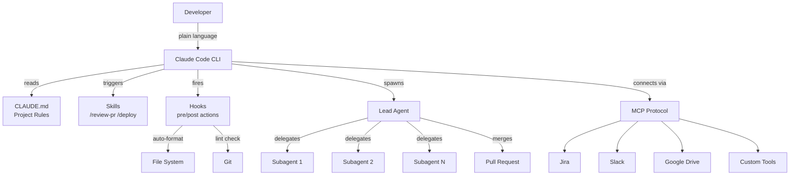

# Claude Code's Full Extension Stack: Skills, Hooks, Subagents, MCP — The Architecture That Turned a CLI Into an OS for Code

**TL;DR:** Anthropic spent twelve months building a **five-layer extension architecture** — CLAUDE.md, Skills, Hooks, MCP, and Agent Teams — that turned **Claude Code** from a CLI preview into composable infrastructure for software engineering. On February 9, 2026, **16 agents wrote a C compiler in Rust for ~$20,000** in compute. The architecture behind that feat — not the model itself — is what separates Claude Code from every other AI coding tool on the market.

## Background

For most of 2025, AI coding assistants operated on a simple formula: one model, one conversation, one file at a time. GitHub Copilot suggested inline completions. Cursor embedded an LLM in a VS Code fork. Both treated AI as an editor feature — powerful, but structurally constrained to the boundaries of a text buffer.

When developers needed these tools to connect to external systems — Jira for tickets, Slack for context, a CI pipeline for validation — they reached for fragile plugin architectures or hand-rolled API wrappers. Every integration was bespoke. Nothing composed.

**[Claude Code](/glossary/claude-code)** launched in February 2025 as an [agentic coding](/glossary/agentic-coding) CLI: a terminal tool that could read your codebase, edit files, run shell commands, and manage git operations. On the surface, it looked like another entrant in a crowded field. Underneath, Anthropic was pursuing a different endgame entirely — not a coding assistant, but a full extension architecture designed to make an AI agent composable, configurable, and capable of orchestrating multiple instances of itself.

The distinction matters because it determines the ceiling. An editor feature is bounded by the editor's extension model. Infrastructure has no ceiling. You can pipe data into it, chain it with other tools, run it headless in CI/CD, and treat it as a building block rather than a destination. Anthropic chose the infrastructure path, and every major milestone that followed — the $20K compiler, NASA's Mars rover route, the 5.5x revenue surge — traces back to that architectural decision.

## What Happened

The extension stack assembled over twelve months in five distinct phases.

**February 2025** — Claude Code launched as a CLI preview with agentic file editing and shell access. The key primitive was already present: `CLAUDE.md`, a project-level configuration file parsed at session startup. Every instruction in it — build commands, coding standards, architecture constraints — became binding rules for the AI agent. This was the first layer.

**May 2025** — General Availability shipped alongside Claude 4 and the **[Model Context Protocol (MCP)](/glossary/mcp)**, an open standard designed to replace bespoke plugin systems with universal connectors. Instead of building custom integrations for each tool, MCP provided a standardized protocol for Claude Code to read from Google Drive, update Jira tickets, pull Slack threads, and interface with enterprise systems. Because it's open, any developer can build an MCP server for any data source.

**July–October 2025** — Revenue surged 5.5x. Engineers at Microsoft, Google, and OpenAI were actively using a competitor's coding tool — a signal that Claude Code's agentic approach solved problems inline autocomplete couldn't. **Skills** (packaged `SKILL.md` files) and **Hooks** (shell-command triggers) matured during this period, giving teams declarative control over AI workflows without writing integration code.

**December 2025** — NASA engineers used Claude Code to [plan a 400-meter route](https://www.anthropic.com/research/claude-on-mars) for the Perseverance Mars rover. This was the first confirmed use of an AI coding agent in active space exploration — and a validation of reliability in a context where failure means losing a $2.7 billion asset on another planet.

**February 5, 2026** — Anthropic shipped Claude Opus 4.6 with **agent teams**: the ability for a lead agent to spawn multiple subagents working concurrently. Four days later, security researcher Nicholas Carlini proved the concept by orchestrating [16 agents to write a complete C compiler](https://www.theregister.com/2026/02/09/claude_opus_c_compiler/) from scratch in Rust. The compiler could compile the Linux kernel.

**Key specs:**
- **Model:** Claude Opus 4.6 (released February 5, 2026)
- **Agents used:** 16 concurrent subagents + 1 lead agent
- **Output:** Functional C compiler in Rust, compiles the Linux kernel
- **Compute cost:** ~$20,000
- **Time frame:** Hours, not weeks

## How It Works

Claude Code's extension stack has five layers, each addressing a separate concern. The design principle that ties them together: every layer is independent but composable. You can use any combination — Skills without MCP, Hooks without Agent Teams — or the full stack together.

**Layer 1 — CLAUDE.md (Project Rules).** A markdown file at your repository root, parsed at every session startup. It defines build commands (`npm run build`, `cargo test`), coding standards, architecture constraints, and mandatory checklists. Every agent in a team inherits these rules — one file governs behavior across all subagents. Think of it as a `.editorconfig` for AI behavior, but with far broader scope. Because it's version-controlled, the AI's behavior travels with the codebase. When you `git clone`, the agent's instructions clone with it.

**Layer 2 — Skills (Reusable Workflows).** Skills live as `SKILL.md` files in `skills/{name}/` directories. Each skill packages domain-specific instructions: tone guidelines, output templates, validation rules, few-shot examples. A `/review-pr` skill might define how to assess code quality, what patterns to flag, and how to format review comments. Claude Code auto-loads the relevant skill based on the user's command. Skills are [composable with MCP and Hooks](/blog/mcp-vs-cli-vs-skills-extend-claude-code) — a skill can reference external data sources and trigger post-action automation.

**Layer 3 — Hooks (Local Automation).** Shell commands that execute before or after specific AI actions. Post-edit hooks trigger formatters (`prettier`, `black`, `gofmt`). Pre-commit hooks run linters and test suites. Post-tool hooks can log every action to an audit trail. Hooks are configured in `.claude/settings.json` and fire automatically — no manual invocation required. This bridges AI-generated code and your team's existing toolchain without modifying either side.

**Layer 4 — MCP (External Data).** The [Model Context Protocol](/glossary/mcp) gives Claude Code standardized access to external systems. An MCP server is a lightweight adapter that exposes a data source — Jira, Slack, Google Drive, a Postgres database, a custom internal tool — through a common protocol. Claude Code can pull context from these sources mid-session, making agents project-aware rather than code-only. Because MCP is an open standard, the ecosystem of available servers grows independently of Anthropic.

**Layer 5 — Agent Teams (Parallel Execution).** The Agent SDK allows a lead agent to decompose a task and delegate subtasks to subagents that work concurrently. Each subagent operates on a separate concern — one handles the parser, another the code generator, a third writes tests — while the lead coordinates and merges outputs. In Carlini's compiler experiment, 16 subagents simultaneously built different compiler components while the lead managed integration and consistency. The architecture supports arbitrary depth: a subagent can spawn its own subagents.

The Unix philosophy is deliberate. Claude Code reads from stdin, writes to stdout, and exits with status codes. You can pipe build logs into it, run it headless in CI/CD, chain it with `jq` and `grep`, and treat it as a composable command-line primitive. This is fundamentally different from editor-embedded AI. It's infrastructure that happens to understand code.

## Why It Matters

The extension stack redefines what "developer tooling" means by collapsing the distance between intent and execution.

When a tool can read your Jira board (MCP), understand your project rules (CLAUDE.md), follow your team's workflow (Skills), enforce your quality standards (Hooks), and parallelize across coordinated agents (Agent Teams) — all configured through version-controlled files that live in your repo — the boundary between "tool" and "team member" dissolves. The AI doesn't need onboarding. It reads the same instructions every other contributor reads.

The economic implications are the sharper edge. Carlini's experiment compressed weeks of senior engineering work into hours at a known compute cost. That's not marginal optimization — it's a structural change in how decomposable engineering tasks get priced. Writing boilerplate, implementing specs, migrating codebases, generating test suites: these are the tasks where agent teams offer 10x–100x cost advantages. Agent teams don't replace architectural thinking or system design, but they dramatically reduce the cost of execution once the design exists.

The market already priced this in. Claude Code's 5.5x revenue surge by July 2025 — before agent teams even shipped — showed developers choosing an agentic CLI over inline autocomplete. Engineers at competitor companies using Claude Code confirmed the architecture, not brand loyalty, drove adoption. NASA trusting it for Mars rover path planning confirmed reliability beyond controlled demos.

The deeper disruption is organizational. If an AI agent can spawn sub-agents, manage git branches, run tests, and open pull requests — coordinated through config files in the repo — the optimal team size for a software project drops. Not because developers become unnecessary, but because the ratio of design work to implementation work shifts dramatically toward design.

## Risks and Limitations

The same composability that enables power amplifies failure modes.

A misconfigured `CLAUDE.md` doesn't just affect one session — it propagates across every agent in a team. When Carlini's 16 agents wrote the compiler, each inherited the same project rules. If those rules contained an error, 16 agents would replicate it simultaneously, at 16x the cost. Configuration management for agent teams is a new discipline that most organizations haven't developed.

The dual-use problem is existential. In August 2025, threat actor GTG-2002 weaponized Claude Code for cyberattacks — an agentic CLI with full shell access and enterprise connectivity is inherently an offensive capability. Anthropic responded in February 2026 with [Claude Code Security](https://www.anthropic.com/news/responsible-scaling-policy-v3), proactive vulnerability scanning, anti-distillation measures, and Responsible Scaling Policy v3.0. These are meaningful mitigations, but the fundamental tension persists: you cannot give an AI agent the power to run arbitrary shell commands, manage git repos, and connect to enterprise systems without creating an attack surface.

Code quality is the quieter risk. Carlini acknowledged his compiler output wasn't optimized. If organizations adopt agent-generated code at scale without proportionally scaling review capacity — because "16 agents wrote it in hours" sounds impressive — they trade velocity for technical debt. Agent teams need the same (or stricter) code review rigor as human teams, precisely because the volume of output can outpace any human reviewer.

## Frequently Asked Questions

### How is Claude Code's architecture different from GitHub Copilot or Cursor?

Copilot and Cursor embed AI in an editor — they suggest code inline or respond in a side panel. Claude Code is an agentic CLI with full shell access that runs in your terminal. The key differentiator is the five-layer extension stack: CLAUDE.md for project rules, Skills for reusable workflows, Hooks for pre/post automation, MCP for external data connectors, and Agent Teams for parallel multi-agent orchestration. Copilot suggests a function body. Claude Code can plan, write, test, commit, and open a PR — across multiple files, with coordinated agents, connected to your Jira board and Slack channels.

### Can I adopt individual layers without committing to the full stack?

Yes — independence is the design principle. Start with a `CLAUDE.md` file (the highest-leverage single change), then add a Skill for your most repetitive workflow, wire Hooks to your formatter and linter, and evaluate MCP servers and Agent Teams as needs grow. Most teams see immediate value from CLAUDE.md alone, since it eliminates the "re-explain the project" problem at the start of every AI session.

### What does the $20K compiler experiment actually prove?

It proves multi-agent orchestration works for large, decomposable engineering tasks — and reveals both potential and limits. The compiler compiled the Linux kernel, which is non-trivial, but the output wasn't optimized. The experiment demonstrates coordination and parallelism, not production-grade code generation. The real insight is economic: tasks that occupy senior teams for weeks can now be attempted in hours at a predictable compute cost. Whether the output meets production standards depends on the review and testing pipeline wrapping the agents.

### What security measures protect against misuse of the extension stack?

After the GTG-2002 incident, Anthropic shipped Claude Code Security (proactive vulnerability scanning), anti-distillation protections, and Responsible Scaling Policy v3.0 in February 2026. At the stack level, Hooks can enforce pre-commit security checks, CLAUDE.md can define security constraints that all agents must follow, and the Agent SDK provides granular permission controls for subagent actions. Organizations can restrict which shell commands agents execute and which MCP servers they connect to. The defense-in-depth approach mirrors traditional infrastructure security — no single layer is sufficient alone.

## References

- [Anthropic releases Opus 4.6 with new 'agent teams'](https://techcrunch.com/2026/02/05/anthropic-releases-opus-4-6-agent-teams/) — TechCrunch, 2026-02-05
- [Claude Opus 4.6 spends $20K trying to write a C compiler](https://www.theregister.com/2026/02/09/claude_opus_c_compiler/) — The Register, 2026-02-09
- [Claude Code — Official Documentation](https://docs.anthropic.com/en/docs/claude-code) — Anthropic, 2026-03-01
- [Claude on Mars](https://www.anthropic.com/research/claude-on-mars) — Anthropic, 2026-01-30
- [Responsible Scaling Policy Version 3.0](https://www.anthropic.com/news/responsible-scaling-policy-v3) — Anthropic, 2026-02-24

**Related**: [Today's newsletter](/newsletter/2026-03-12) covers the broader AI landscape. See also: [MCP vs CLI vs Skills: How to Extend Claude Code](/blog/mcp-vs-cli-vs-skills-extend-claude-code) and [Claude Code Agent Teams](/blog/claude-code-agent-teams).

---

*Found this useful? [Subscribe to AI News](/subscribe) for daily AI briefings.*
