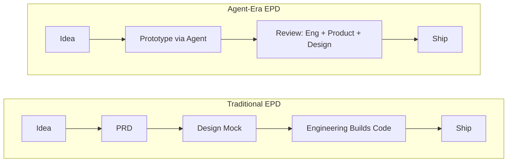

# How Coding Agents Are Reshaping Engineering, Product and Design

Harrison Chase, CEO of [LangChain](/glossary/langchain), just published a framework for thinking about what **[coding agents](/blog/9-principles-writing-claude-code-skills)** mean for EPD — Engineering, Product, and Design. His core argument: when the output of an entire EPD organization is code, and code is suddenly cheap to produce, the entire function restructures around review instead of implementation. The traditional PRD-to-mock-to-code waterfall is dead, generalists become the highest-leverage players, and every role on the team needs to rethink what "good" looks like. Whether you're an engineer, PM, or designer, the implications are concrete and immediate.

## What Happened

Chase published [a detailed analysis](https://blog.[langchain](/topics/langchain).com/how-coding-agents-are-reshaping-engineering-product-and-design/) of how coding agents are transforming the EPD workflow at software companies. His argument starts from a deceptively simple observation: EPD's output is code. Software companies exist to create functional software that solves business problems — and that software is, at the end of the day, just code.

The traditional EPD process followed a predictable waterfall: someone (usually a PM) has an idea, writes a **PRD** (Product Requirement Document), design creates mocks from the PRD, and engineering turns mocks into code. This process existed because implementation was expensive. Specialization developed around that expense, and PRDs became the coordination mechanism between specialists.

**Coding agents** collapse this pipeline. They take an idea and produce functional software directly. The PRD-to-mock-to-code chain — the textbook way to build software for the past two decades — breaks when any team member can generate a working prototype in hours instead of weeks.

Chase isn't just theorizing. He's describing what he sees happening at LangChain and across the companies in their ecosystem: more prototypes, faster iteration, and a fundamental shift in where bottlenecks sit.

## The EPD Workflow Shift

## Why It Matters

The most significant structural change is the **bottleneck shift from implementation to review**. Previously, engineering capacity was the constraint. PMs and designers queued work, engineers implemented it, and the rate of shipping was gated by how fast code got written.

Now anyone can write code. That sounds liberating — and it is — but it creates a new problem: the volume of prototypes and code changes explodes, and the organization's ability to review them doesn't scale at the same rate. Chase identifies three dimensions of review that become critical:

1. **Engineering review**: Is the code well-architected, scalable, performant, and robust?
2. **Product review**: Does this actually solve the user's pain point?
3. **Design review**: Are the interfaces intuitive and easy to use?

Each of these review functions now faces a throughput problem. When implementation was slow, reviewers had a manageable queue. When implementation is near-instant, the review queue becomes the bottleneck.

This has second-order effects on hiring and team structure. Chase argues **generalists** — people with strong instincts across product, engineering, and design — become dramatically more valuable. A single generalist with [coding agents](/glossary/coding-agent) can outpace a specialized team of three, because they eliminate the communication overhead that coordination between specialists demands. One person who can build, evaluate product-market fit, and assess UX quality in a single loop moves faster than a team passing artifacts between roles.

## Technical Deep-Dive

Chase's most nuanced point is about what happens to PRDs. "PRDs are dead" makes a good headline, but his actual position is more interesting: **the traditional PRD process is dead, but documents describing product requirements are essential**.

Here's the distinction. In the old model, the PRD was the starting artifact — it kicked off the waterfall. In the new model, someone builds a prototype first, then needs to communicate intent before handing it off for review. The document shifts from being a *specification for what to build* to being a *companion explaining why something was built this way*.

This is a meaningful architectural change in how teams communicate. A reviewer looking at AI-generated code can't tell what's intentional versus accidental without understanding the builder's intent. The PRD becomes a review artifact, not a build artifact.

Chase floats an intriguing idea: what if future PRDs are structured, versioned prompts? Instead of a Word doc describing requirements, you share the prompt chain that generated the prototype. The prompts *are* the specification — they encode both the intent and the constraints in a format that's reproducible and auditable.

This maps to a broader pattern in AI-assisted development. Tools like [Claude Code](/glossary/claude-code) already support project-level configuration through `[CLAUDE.md](/blog/claude-code-memory)` files and skill systems that encode team standards in version-controlled markdown. The line between "prompt" and "specification" is blurring.

Chase also makes a pointed observation about role dynamics: coding agents are no longer optional tooling — they're a **requirement**. PMs who adopt agents validate ideas by building prototypes directly instead of writing specs and waiting. Designers who adopt agents can test interaction patterns in code rather than static mockups. Engineers who adopt agents handle broader scope and move faster on architecture decisions.

The flip side is equally sharp: the bar for specialization rises. If a coding agent can handle 80% of implementation, a specialist needs to deliver value in the remaining 20% that agents can't reach — deep systems thinking, novel architecture, nuanced UX research, strategic product insight. Surface-level specialization gets automated away.

## What You Should Do

1. **Adopt coding agents now if you haven't.** This isn't a future trend — it's a current requirement. PMs should prototype with agents. Designers should test in code. Engineers should multiply their output.
2. **Restructure your review process.** If your team's bottleneck has shifted from writing code to reviewing it, invest in review tooling, clearer review criteria, and dedicated review time.
3. **Invest in generalists.** When hiring or developing talent, prioritize people who can operate across product, engineering, and design boundaries.
4. **Rethink your PRD format.** Experiment with pairing prototypes with intent documents — or even with the prompt chains used to generate them. The PRD-first workflow is the one to sunset, not the documentation itself.
5. **Raise your specialization bar.** If your role is primarily implementation, start building review skills and domain depth that coding agents can't replicate.

**Related**: [Today's newsletter](/newsletter/2026-03-16) covers the broader AI development landscape. See also: [Claude Code Skills Guide](/blog/claude-code-skills-guide) for how to encode team standards into AI workflows.

---

*Found this useful? [Subscribe to AI News](/subscribe) for daily AI briefings.*
