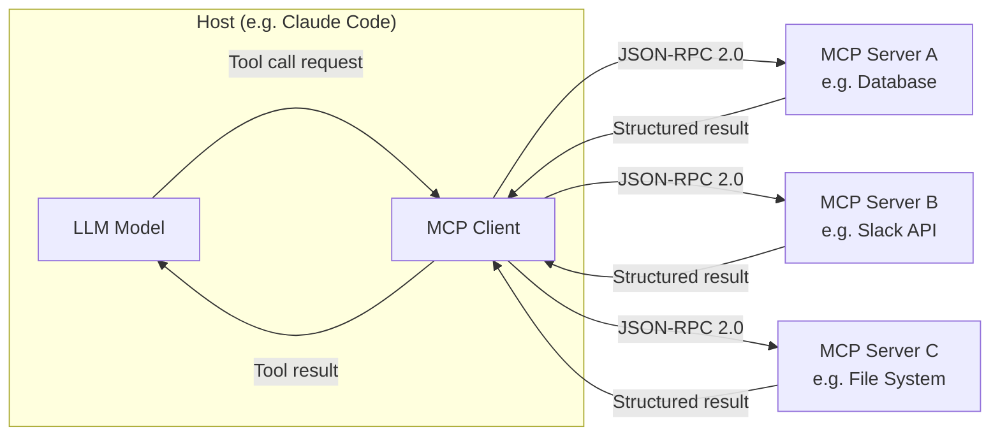

# How to Create an MCP Server: Architecture, Implementation, and Best Practices

The **[Model Context Protocol](/glossary/model-context-protocol) ([MCP](/glossary/mcp))** — introduced by Anthropic in November 2024 — is an open-source standard for connecting AI models to external data sources and tools. If you're building an integration between an LLM and an external API, database, or service, creating an MCP server is now the canonical approach, backed by OpenAI, [Google DeepMind](/blog/gemini-3-1-pro-complex-tasks), Microsoft, and [Apple](/glossary/apple). This guide covers the architecture, transport options, and what you need to know before writing your first server.

## Why MCP Exists: The M×N Problem

Before MCP, every AI integration was bespoke. If you had M AI models and N external tools, you needed M×N custom connectors — each with its own authentication logic, data format, and error handling. MCP collapses this into an **M+N architecture**: each model implements the MCP client spec once, each tool implements the MCP server spec once, and they interoperate automatically.

The analogy Anthropic uses is "USB-C for AI" — a single port standard that works regardless of what's on either end. By December 2025, Anthropic had donated the project to the **[Agentic](/glossary/agentic) AI Foundation (AAIF)** under the Linux Foundation, ensuring vendor-neutral governance. The protocol had reached over 97 million monthly SDK downloads by early 2026.

## Core Architecture: Client-Host-Server

An MCP deployment has three components:

- **Host**: The application running the LLM (e.g., Claude Code, a custom agent)
- **Client**: The MCP client embedded in the host, managing connections to servers
- **Server**: Your code — exposes tools, resources, and prompts to the AI model

When a model needs to call an external tool, the host routes the request through the client to the appropriate MCP server. The server executes the operation and returns structured results. All communication uses **JSON-RPC 2.0** — a lightweight, well-specified remote procedure call protocol.

This separation matters: your server doesn't need to know which AI model is calling it. A single MCP server you write today works with Claude, GPT-4, Gemini, and any future model that implements the client spec.

## Transport Options: stdio vs. Streamable HTTP

MCP supports two transport mechanisms, and your choice affects deployment architecture significantly.

**stdio (Standard I/O)**
The server runs as a local subprocess. The host spawns the process and communicates via stdin/stdout. This is the simplest option — no networking, no authentication, no port management. It's the right choice for:
- Local developer tools
- CLI integrations
- Tools that need direct filesystem or process access

**Streamable HTTP**
The newer transport option, Streamable HTTP allows the server to run as a remote network service. This enables:
- Shared servers across multiple clients
- Cloud deployment
- Multi-user scenarios

Streamable HTTP requires more infrastructure but unlocks MCP as a service layer. According to the research, detailed latency benchmarks comparing the two transports are not yet publicly available — factor that into capacity planning for production deployments.

## Building a Basic MCP Server

A minimal MCP server needs to handle three capability types:

**Tools** — functions the AI can call. Each tool has a name, description, and input schema. The description is critical: the model reads it to decide whether to invoke the tool. Be precise about what the tool does, what inputs it expects, and what it returns.

**Resources** — data the AI can read. Think of these as read-only endpoints: files, database records, API responses. Resources are identified by URIs and returned as structured content.

**Prompts** — reusable prompt templates the host can surface to users. Less commonly used but valuable for standardizing multi-step workflows.

The implementation flow:
1. Initialize the server with your tool/resource/prompt definitions
2. Register handlers for each capability
3. Connect the transport (stdio or HTTP)
4. Handle the JSON-RPC lifecycle: initialize → list capabilities → handle requests → shutdown

Most developers start with the official MCP SDKs, which are available in multiple languages and handle the JSON-RPC plumbing. You define your tools as typed functions; the SDK handles serialization, capability negotiation, and transport.

## Security: What to Get Right Early

MCP's security model is an active development area. The protocol supports **OAuth 2.1** for authorization on remote servers, but researchers have flagged two categories of risk worth understanding before you ship:

**Prompt injection**: A malicious data source could embed instructions in content your server returns, causing the AI to take unintended actions. Sanitize all external data before returning it as tool output. Treat tool results like user input — untrusted by default.

**Tool execution scope**: An MCP server with broad permissions is a high-value target. Apply the principle of least privilege: each server should have exactly the permissions it needs for its stated function, nothing more. A server that reads a database shouldn't also have write access unless the use case requires it.

For local stdio servers, the attack surface is narrower — the server runs with the host process's permissions. For remote HTTP servers, implement proper authentication before exposing them to any network.

## Ecosystem and Adoption

The protocol's adoption trajectory is unusual for an open standard — broad vendor buy-in within the first year. By early 2026, MCP clients were integrated into major AI platforms and developer tools. The donation to the Linux Foundation's AAIF in December 2025 addressed early concerns about Anthropic-specific lock-in.

For [agentic coding](/glossary/agentic-coding) use cases specifically, MCP servers are how Claude Code connects to external data sources — databases, monitoring systems, internal APIs. Building your integrations as MCP servers means they're immediately usable from Claude Code, other MCP-compatible clients, and any future tooling that adopts the standard.

## What's Next

The MCP specification is evolving. Current active development areas include:
- Refined OAuth 2.1 authorization flows for enterprise deployments
- Tooling for server discovery and registry
- Security hardening against prompt injection patterns

For teams building production MCP integrations, the Linux Foundation governance model means the spec stabilizes via community process rather than Anthropic's roadmap alone — a meaningful shift for long-term investment decisions.

Read our analysis of [how Claude Code approaches tool use](/blog/claude-code-is-not-a-coding-tool) for context on how MCP servers fit into larger agentic workflows. For a broader view of what these capabilities enable, see our [key features and benefits overview](/blog/key-benefits-and-features).

---

*Want more AI insights? [Subscribe to LoreAI](/subscribe) for daily briefings.*
