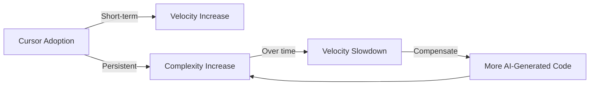

# Cursor AI Increases Speed but Hurts Code Quality, Study Finds

The first rigorous causal study of **Cursor AI**'s impact on real-world open-source projects confirms what many senior engineers suspected: [LLM-powered coding agents](/glossary/llm-agent) deliver a measurable velocity boost, but that speed comes with a persistent increase in code complexity and static analysis warnings. Researchers from Carnegie Mellon University used difference-in-differences analysis across GitHub projects to show the tradeoff isn't just anecdotal — it's statistically significant and, worse, the quality degradation compounds over time while the speed gains fade. If you're using AI coding tools without quality gates, you're borrowing against your future velocity.

## What Happened

Researchers Hao He, Courtney Miller, Shyam Agarwal, Christian Kästner, and Bogdan Vasilescu published ["Speed at the Cost of Quality"](https://arxiv.org/abs/2511.04427) — a study accepted at MSR '26 (International Conference on Mining Software Repositories) that estimates the **causal effect** of Cursor adoption on development outcomes.

The methodology is unusually strong for this kind of study. Instead of surveys or self-reported productivity metrics, the team used a difference-in-differences design: they identified GitHub projects that adopted Cursor and matched each with a control group of similar projects that didn't. This lets them isolate Cursor's effect from confounding factors like project maturity, team size, or language ecosystem.

Key findings:

| Metric | Short-Term Effect | Long-Term Effect |
|--------|------------------|------------------|
| **Development velocity** (commits, PRs, lines changed) | Statistically significant increase | Diminishes over time |
| **Static analysis warnings** | Substantial increase | Persistent — does not fade |
| **Code complexity** (cyclomatic) | Substantial increase | Persistent and compounding |
| **Net productivity** | Positive | Turns negative as debt accumulates |

In other words, Cursor makes you faster at first, but the mess it creates eventually eats the speed gains.

## Why It Matters

This study matters because it's the first to move beyond vibes and anecdotes. Every AI coding tool vendor claims "multifold productivity increases." Developers on Twitter share impressive demos. But nobody had done the causal analysis on real production codebases — until now.

The implications cut several ways.

**For individual developers**: The velocity boost is real but temporary. If you're not pairing Cursor with linting, static analysis, and code review, you're accumulating technical debt faster than you're shipping features. The study suggests that the quality assurance layer is the bottleneck, not code generation.

**For teams**: Adopting [Cursor](/glossary/cursor) (or any LLM coding agent) without updating your quality processes is a trap. The initial sprint feels great — PRs fly through, features land fast. Six months later, you're fighting a codebase full of subtle complexity that slows everything down.

**For tool builders**: The paper explicitly calls for quality assurance to be "a first-class citizen in the design of agentic AI coding tools." Current tools optimize for generation speed. The research suggests they should optimize for maintainability, readability, and correctness just as aggressively. Tools that integrate linting, testing, and complexity analysis into the generation loop — rather than treating them as afterthoughts — will win long-term.

**For the broader debate**: This adds empirical weight to the "AI slop" concern in software engineering. The quality degradation isn't hypothetical. It's measurable, persistent, and causally linked to LLM agent adoption.

## Technical Deep-Dive

The difference-in-differences (DiD) design deserves attention because it's the gold standard for causal inference in observational studies. The researchers couldn't run a randomized experiment (you can't randomly assign Cursor to open-source projects), so they used matching and DiD to approximate one.

The matching process paired Cursor-adopting projects with control projects based on observable characteristics: language, stars, contributor count, commit frequency, and other signals. The DiD design then compares changes in outcomes (velocity, warnings, complexity) between treatment and control groups before and after adoption.

Static analysis warnings were measured using standard tooling (likely ESLint, Pylint, or similar per-language analyzers). Code complexity was measured using cyclomatic complexity and related metrics. These aren't perfect proxies for "code quality," but they're well-established and automated — which matters for a large-scale study.

The generalized method of moments (GMM) panel estimation is the most technically interesting part. It establishes a **feedback loop**: Cursor increases complexity → increased complexity reduces future velocity → teams push harder with Cursor to compensate → more complexity. This vicious cycle explains why the velocity gains are transient but the quality costs are permanent.

One caveat: the study focuses on open-source projects, which may differ from commercial codebases in important ways. Open-source projects often have less rigorous CI/CD pipelines, fewer mandatory code reviews, and more varied contributor experience levels. Projects with strong quality gates might mitigate the complexity accumulation. The paper acknowledges this but doesn't test it directly.

Another limitation: the study examines Cursor specifically, not all AI coding tools. Different tools with different default behaviors (e.g., tools that run tests automatically or enforce linting before accepting generated code) might produce different outcomes.

## What You Should Do

1. **Add quality gates to your AI workflow now.** Run static analysis and complexity checks on every AI-generated PR. Tools like [Claude Code](/glossary/claude-code) can be configured with `CLAUDE.md` rules that enforce linting and testing before any commit — this study is exactly why that matters.
2. **Track complexity metrics over time.** If you adopted an AI coding tool recently, run a complexity analysis on your codebase and compare to six months ago. The degradation may already be visible.
3. **Don't trust velocity metrics in isolation.** If your team is shipping faster but not measuring code quality, you're flying blind. Add static analysis warning counts and cyclomatic complexity to your engineering dashboards.
4. **Review AI-generated code more carefully, not less.** The temptation is to rubber-stamp fast PRs. The data says that's where the debt accumulates.
5. **Read the [full paper](https://arxiv.org/abs/2511.04427)** — it's well-written and the methodology section is a masterclass in applied causal inference for software engineering research.

**Related**: [Today's newsletter](/newsletter/2026-03-18) covers the broader AI tooling landscape. See also: [Claude Code vs Cursor](/compare/claude-code-vs-cursor).

---

*Found this useful? [Subscribe to AI News](/subscribe) for daily AI briefings.*