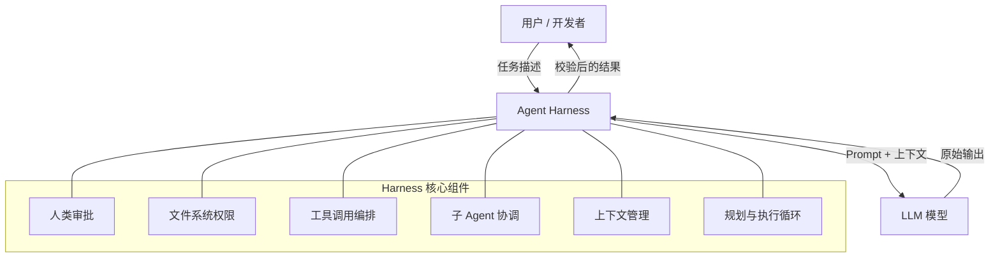

# Agent Harness 才是 2026 年 AI 竞争的真正护城河

**Manus** 半年重写了 5 次架构，模型始终没换，任务完成率却持续提升。这个反直觉的事实揭示了 2026 年 AI 竞争格局的根本转变：护城河不在模型，在 **harness**——包裹模型的基础设施。本文拆解 harness 的 6 大核心组件和 3 条设计铁律，帮你搭建真正靠谱的 [AI Agent](/glossary/ai-agent) 系统。

## 发生了什么

Aakash Gupta 的最新研究提出了一个颠覆行业认知的判断：模型是发动机，harness 是整辆车。最好的发动机没有方向盘和刹车，哪儿也去不了。

三家顶级公司的实践佐证了这个观点。**Manus** 半年内将 harness 架构改写了 5 次，模型未变，每次改写后任务完成率都在提升。**LangChain** 的 Deep Research 产品一年内迭代了 4 版架构，驱动改善的不是模型升级，而是更合理的工作流编排和上下文管理。最反直觉的是 **Vercel**：他们的 Agent 原本配了搜索、代码、文件、API 等一整套工具库，结果 Agent 反而被搞糊涂，乱调工具、多走弯路。砍掉 80% 的工具后，响应更快，成功率更高。

**Claude Code** 同样验证了这一点——爆火的不是 Claude 模型本身，而是 Claude Code 这套 harness。同一个模型，换一套更好的基础设施，产品体验天差地别。

## 为什么重要

一个常见的误判是：等下一代模型出来，这些问题就自动解决了。事实恰好相反，模型越强，harness 反而越重要。

原因有三。第一，更强的模型能力更多，但更多能力意味着更多的失败模式，需要更精密的错误处理。第二，强模型更贵，好的 harness 能把简单任务路由给便宜模型，显著降低成本。第三，生产环境要求 99.9% 的可用率，模型天生是概率性的，只有 harness 才能提供回退机制和结果校验。

竞争格局已经变了。以前的护城河是模型质量，GPT-4、Claude、Gemini 谁强谁赢。但现在模型质量快速趋同，几周就能训出有竞争力的模型。新护城河是 harness 质量——Manus 花了半年、LangChain 花了一年积累的工程经验，没法从 Hugging Face 上下载。

## Agent Harness 架构总览

## 技术细节

Phil Schmid 的研究发现，简单的 harness 往往比复杂的脚手架表现更好。一个靠谱的 Agent harness 需要 **6 大核心组件**：

1. **人类审批**：删库、扣款、发邮件等不可逆操作必须等人确认。Replit 的做法是代码随便写，但部署必须等人点头。
2. **文件系统权限**：严格控制模型能碰哪些目录、能做哪些操作。Claude Code 的 harness 直接禁止模型触碰系统文件。
3. **工具调用编排**：不是工具越多越好，关键是编排调用顺序和错误处理逻辑。Vercel 砍工具的案例已经证明了这一点。
4. **子 Agent 协调**：复杂任务需要分工——调研、撰写、审查各司其职，harness 负责合并结果、解决冲突。
5. **[提示词](/glossary/prompt-engineering)预设库**：写代码和审查代码、修 Bug 和开发新功能，需要完全不同的指令集。
6. **生命周期钩子**：初始化上下文、执行任务、保存状态、处理失败、自动 retry、全程日志记录，保证每次都走完整条路。

组装这些零件需要遵循 **3 条设计铁律**：最小必要干预（模型能搞定的别插手，只在不可逆操作时介入）；渐进开放权限（像新员工入职一样，先只读再写权限）；快速失败加恢复路径（Agent 卡住不要原地打转烧 Token，立刻换路线或交给人类）。

## 你现在该做什么

从小做起。把你的 Agent 最近出错的 case 收集起来做个分类：有多少是模型回答质量差？有多少是流程控制、错误处理、权限管理的问题？大概率，大部分属于后者。

选最常失败的一个任务，用上面 6 个组件做清单逐一检查，缺哪个补哪个。不需要一步到位——Manus 迭代了 5 版，LangChain 迭代了 4 版。先让一个任务的成功率翻倍，就是最好的起步。

**相关阅读**：[AI Agent 术语表](/glossary/ai-agent) · [Prompt Engineering 指南](/glossary/prompt-engineering)

---

*觉得有用？[订阅 AI 简报](/subscribe)，每天 5 分钟掌握 AI 动态。*