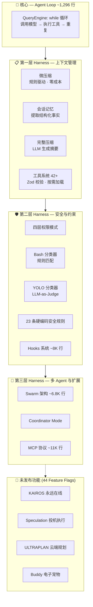
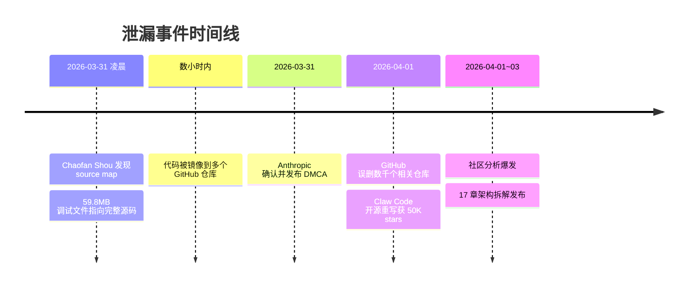
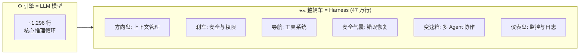
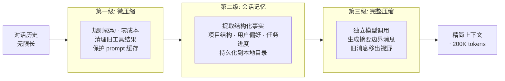
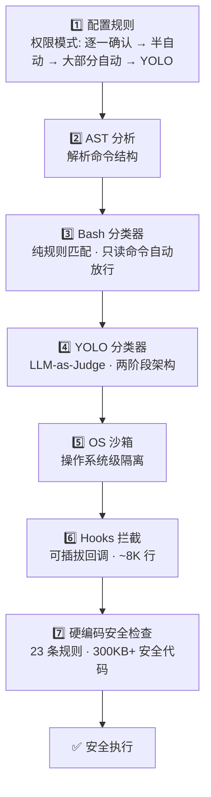
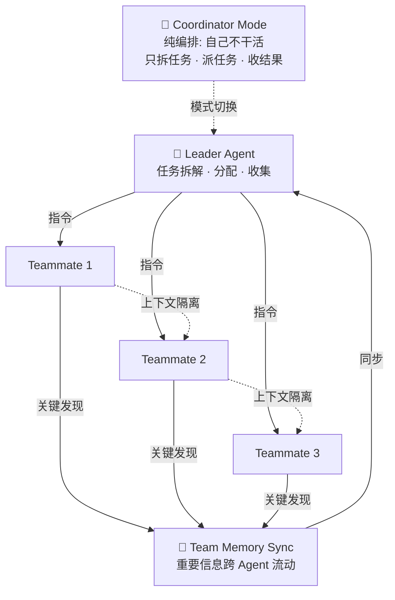

# Agent Loop：为什么最强 AI Agent 的核心只是一个 While 循环？

> **系列说明**：这是「从 [Claude Code](/zh/blog/9-principles-writing-claude-code-skills) 泄漏源码学 Agent 工程实践」系列的第 2 期。[第 1 期全景篇](链接到第1期)我们建立了 Claude Code 的完整认知框架。本期深入 Agent Loop——整个系统的心脏。

上一期我们说了一个结论：Claude Code 用不到 2,000 行代码实现了核心循环，用超过 47 万行代码让这个循环变得可靠。

这就引出一个问题：**这个"核心循环"到底是什么？它为什么如此重要？为什么全球最强的编码 Agent，核心竟然是一个 while(true)？**

今天我们来拆这个循环的每一步。

## 先建立一个直觉：Agent Loop 是什么？

如果你用过 Claude Code（或者任何 AI [coding agent](/zh/blog/coding-agents-reshaping-epd)），你会感觉它在"思考"——它读代码、跑测试、改文件、再跑测试、再改文件……直到任务完成。

这种感觉的背后，就是 Agent Loop。

用最通俗的话讲：Agent Loop 就是一个不断重复的决策循环。

1. **看**——收集当前的上下文信息
2. **想**——调用模型，让它决定下一步做什么
3. **做**——如果模型说"用某个工具"，就执行那个工具
4. **反馈**——把执行结果告诉模型，让它再决定
5. **重复**——直到模型说"我完成了"，或者资源耗尽

这个"看-想-做-反馈-重复"的模式，就是几乎所有 [AI agent](/zh/blog/effective-harnesses-for-long-running-agents) 的基本骨架。不只是 Claude Code，[Cursor](/zh/glossary/cursor) 的 Agent Mode、[GitHub Copilot](/zh/glossary/github-[copilot](/zh/glossary/copilot)) 的 Workspace、[Devin](/zh/glossary/devin)——它们的核心都是某种形式的 Agent Loop。

差别在于：**循环本身有多简单，循环周围的系统有多精密。**

Claude Code 选择了一个极端的设计哲学：**把循环做到极致简单，把所有复杂性推到循环的外围。** 这个选择，值得每个 AI builder 仔细思考。

## QueryEngine：Claude Code 的大脑

在 Claude Code 的源码里，Agent Loop 的实现叫 **QueryEngine**。它分为两层：

### 上层：Session Layer（会话层）

`QueryEngine` 类负责跨轮次的状态管理。当你和 Claude Code 进行一场持续的对话时，Session Layer 在做这些事：

- 维护整场对话的累计 token 使用量
- 追踪哪些权限请求被用户拒绝过（下次不再重复请求）
- 提供 `submitMessage()` 接口——这是用户每次输入的入口

你可以把 Session Layer 想象成一个"记忆管理者"，它记住对话的全局状态，但不负责具体的思考。

### 下层：Turn Layer（单轮层）

`query` 函数是真正的执行引擎，包含约 **1,730 行代码**的核心 `while(true)` 循环。每次用户输入一条消息，Turn Layer 就启动一轮循环：

1. 预处理用户输入（解析斜杠命令、附件等）
2. 组装上下文（系统提示词 + 自定义提示 + 记忆 + 当轮附件）
3. 调用模型 API
4. 如果模型要求使用工具 → 执行工具 → 把结果送回模型 → 继续循环
5. 如果触发了任何续行条件 → 处理后继续循环
6. 如果模型说"完成了"或触发终止条件 → 退出循环

两层分离的好处是：Session Layer 只需要关心"对话级别"的状态（token 总量、权限记录），Turn Layer 只需要关心"当前这一轮"怎么把事情做完。各管各的，互不干涉。

## while(true) 的每一步：比你想象的精密得多

看起来简单的 while(true) 循环，实际执行起来要处理大量的边界情况。让我们放大来看。

### 循环的主体流程

每一次迭代，循环携带一个类型化的 `State` 对象，里面包含：
- 当前的消息历史和工具调用上下文
- 自动压缩的追踪状态
- 输出限制恢复的计数器
- 一个 `transition` 字段——记录"为什么这次循环要继续"

这个 `transition` 字段是一个精妙的设计。它不只是一个调试用的日志，而是**整个循环的决策依据**。每次循环继续时，系统必须明确说出"我为什么要再跑一轮"，这让循环的行为完全可追踪、可审计。

### 7 种循环续行原因

Claude Code 的 Agent Loop 有 **7 种明确的续行原因**，每一种都对应一个特定的场景和处理策略：

**1. `max_output_tokens_escalate`（输出限制升级）**
模型第一次命中 8K token 的输出上限时触发。系统不报错，而是把限制升级到 64K，然后重试。这意味着 Claude Code 默认用一个较低的输出限制来节省成本，只有当模型真的需要更多空间时才放开。

**2. `max_output_tokens_recovery`（输出限制恢复）**
模型达到了输出上限但任务未完成。系统注入一条元消息——"Resume directly"（直接继续）——然后让模型从断点续写。最多重试 3 次。

**3. `reactive_compact_retry`（被动压缩重试）**
API 返回 413 错误（请求体太大），说明对话历史超过了模型的上下文窗口。系统执行一次紧急压缩，然后重试。

**4. `collapse_drain_retry`（上下文坍缩重试）**
上下文坍缩的多个阶段被逐步消耗完后触发重试。这是一个渐进式的上下文清理机制。

**5. `stop_hook_blocking`（Hook 拦截）**
一个 Stop Hook 返回了阻塞错误。Hook 是可插拔的检查点，可以在循环的关键节点拦截执行。

**6. `token_budget_continuation`（Token 预算续行）**
预算系统判断任务尚未完成，注入一个提示消息让模型继续工作。

**7. 隐式续行：存在工具调用**
最常见的情况——模型的响应中包含工具调用请求。执行工具，送回结果，继续循环。

### 循环的终止条件

循环通过 `Terminal` 状态退出，具体有 7 种终止原因：

- `completed`——模型正常完成
- `blocking_limit`——达到硬性限制
- `model_error`——模型调用出错
- `prompt_too_long`——压缩后仍然超限
- `aborted_streaming`——流式传输中断
- `stop_hook_prevented`——Hook 阻止了继续
- `image_error`——图像处理出错

**7 种续行 + 7 种终止 = 14 种明确的循环状态转换**。没有任何模糊的"可能继续也可能停止"。每一次循环迭代，系统都能精确说出"我为什么在这里"。

这就是"简单循环 + 精密控制"的设计哲学的具体体现。

## 每次调用模型之前：五级预处理管道

大部分人在思考 Agent Loop 时，注意力都在"调用模型 → 执行工具"这个主循环上。但 Claude Code 在每次调用模型 API **之前**，有一个精密的五级预处理管道在默默工作：

**第一级：Tool Result Budgeting（工具结果预算）**
设置工具输出的总量上限。如果上一轮的工具执行产生了大量输出（比如读了一个很大的文件），这一步会预算控制总量。

**第二级：Snip Compact（片段裁剪）**
移除对话中已经过时的片段。这是一个 feature-gated 的功能，通过 feature flag 控制开关。

**第三级：Microcompact（微压缩）**
这就是我们在第 1 期提到的"不调用模型的压缩"。它感知 Anthropic 服务端的 prompt 缓存状态，选择最优的清理路径。零 API 调用成本。

**第四级：Context Collapse（上下文坍缩）**
把旧的对话轮次"归档"成投影视图。对话的细节被压缩，但结构性信息被保留。

**第五级：Autocompact（自动压缩）**
当对话接近上下文窗口的天花板时触发。它的触发阈值很精确：

- 对于 200K token 的模型，压缩在约 **187K tokens** 时触发（93.5% 利用率）
- 预留 **13,000 tokens 的缓冲区**
- 生成最多 **20,000 tokens 的结构化摘要**
- 压缩后，工作预算重置为 **50,000 tokens**

五级管道从轻到重排列：能用规则解决的不调模型，能局部清理的不全局压缩。只有当前四级都不够用时，才启动最昂贵的第五级。

**对 Builder 的启示**：如果你在做 agent 产品，不要在每次 API 调用时把所有信息"无脑"塞进 context。建立一个分级的预处理管道——哪些信息必须保留，哪些可以摘要，哪些可以丢弃。这个管道的精细程度，直接决定了你的 agent 在长对话中的表现。

## 流式传输：不是等模型说完，而是边说边做

大部分 AI 应用的工作模式是：发请求 → 等模型生成完 → 拿到完整响应 → 处理。但 Claude Code 不是这样的。

Claude Code 直接消费 **原始 SSE（Server-Sent Events）事件流**，而不是使用 SDK 封装好的高级流接口。为什么要这么麻烦？因为这样可以实现**逐事件级别的控制**。

一次模型调用的事件流长这样：

1. `message_start` — 消息开始，包含一个空内容的 Message 对象
2. `content_block_start` → 多个 `content_block_delta` → `content_block_stop` — 内容块的生成过程
3. `message_delta` — 消息级别的变更（usage 和 stop_reason 只有在这个事件中才是最终值）
4. `message_stop` — 消息结束

一个关键细节：usage（token 使用量）和 stop_reason（停止原因）**在最后的 `message_delta` 事件中才是确定的**——它们在流的过程中会被就地修改。这意味着你不能在收到任何一个中间事件时就做最终决策。

### 流式工具执行：边生成边做

更有意思的是 **Streaming Tool Execution**。当这个 feature gate 开启时：

- `StreamingToolExecutor` 在模型**还在生成响应的同时**就开始执行工具
- 工具调用被分成批次（batch），每批最多 **10 个工具并行**执行
- 并行执行的工具之间上下文隔离，串行执行的工具立即传播上下文修改

这意味着 Claude Code 不是"想完了再做"，而是**边想边做**。模型在生成后半段回答时，前半段提到的工具调用可能已经执行完毕了。

### Tombstone Messages：优雅的失败处理

如果流式传输在中途失败怎么办？Claude Code 不会丢掉已经接收到的部分，而是把它标记为 `tombstone` 消息——一种"墓碑"标记。UI 层看到墓碑消息就知道"这条消息不完整，在重试前先移除它"。

这个设计确保了即使在网络不稳定的情况下，用户看到的对话历史依然是干净的，不会出现半截话或重复内容。

**对 Builder 的启示**：流式传输不只是"让用户看到打字效果"的UI优化。在 agent 场景下，流式传输是**并行执行的基础设施**。如果你能在模型生成响应的同时就开始执行工具，每个循环迭代都能节省几秒到十几秒的延迟。对于需要多轮循环的复杂任务，累计起来就是分钟级的体验差异。

## 错误恢复：从不轻易放弃

一个在生产环境中运行的 agent，必须能优雅地处理各种错误。Claude Code 的错误恢复系统是它 Harness 工程的一个典范。

### 三阶段输出限制恢复

当模型的输出命中了 token 限制：

- **第 1 次**：默认 8K 限制被触发 → 升级到 64K → 注入"Resume directly"消息 → 重试
- **第 2 次**：64K 限制被触发 → 再次注入恢复消息 → 重试
- **第 3 次**：仍然超限 → 向用户报告错误

为什么默认限制是 8K 而不是一上来就给 64K？因为大部分回答不需要 64K。用低限制开始可以节省成本，只有真正需要时才放开。这是一种**乐观策略**——先假设简单情况，再逐步升级。

### 智能退避重试：withRetry()

网络错误、API 过载、认证失效……Claude Code 有一套完整的重试机制：

- **指数退避**：每次重试的等待时间按 `2^(attempt-1) * baseDelay + jitter` 计算
- **最多 10 次重试**（可配置）
- **尊重 Retry-After 头**：如果 API 返回了"多久后再试"的提示，按提示来
- **529 特殊处理**：API 过载时用更长的初始等待
- **检测 stale socket**：ECONNRESET / EPIPE 错误触发连接重建
- **401 触发 OAuth 刷新**：认证过期时自动续期
- **400 解析 token 溢出**：从错误响应中提取 token 数量信息，用于下一次压缩

### 回退模型机制

一个值得关注的发现：如果 Opus 模型连续出现 3 次 529（过载）错误，Claude Code 会**静默切换到 Sonnet 模型**作为回退。系统在能力和可用性之间做了一个权衡——宁可用一个稍弱的模型，也不让用户等待或报错。

### Transcript-First：先持久化，再调 API

Claude Code 在调用模型 API **之前**，就先把用户消息持久化到本地磁盘。这意味着即使进程在 API 调用过程中崩溃，对话历史也不会丢失。下次启动时可以从断点恢复。

这个模式叫 **Transcript-First**——先写日记，再做事。简单但关键。

**对 Builder 的启示**：错误恢复不是"出了错就报错"那么简单。一个生产级的 agent 需要分层的恢复策略：先自动重试 → 升级参数 → 切换模型 → 最后才向用户报告。每一步都要有明确的上限，防止无限循环。Claude Code 用 watermark（水位标记）机制来限制每种错误模式的恢复次数——这个设计思路可以直接借用。

## Token 预算管理：知道什么时候该停

一个 agent 可以无限循环，但 token 不是无限的。Claude Code 的预算管理系统解决了一个微妙的问题：**怎么判断模型是"还在高效工作"还是"在空转浪费 token"？**

### 自动续行逻辑

- **COMPLETION_THRESHOLD（完成阈值）**：当 90% 的预算已经被消耗，系统认为工作"基本完成"
- **DIMINISHING_THRESHOLD（递减阈值）**：如果一轮循环只产生了不到 500 个 token 的输出，系统认为"没有实质进展"
- **组合判断**：连续 3 次以上续行 + 每次产出低于 500 token = 停止，而不是继续烧钱

这个机制防止了一种常见的 agent 陷阱——**空转（thrashing）**。模型不断循环，每次只做一点微小的修改，消耗大量 token 但实际上没有推进任务。通过跟踪每轮的实际产出量，系统可以判断"该停了"。

### 预算跨压缩边界的延续

一个容易被忽略的细节：当对话被压缩时，token 预算**不会重置**。系统通过 `task_budget.remaining` 字段，把压缩前已经消耗的预算带到压缩后。这确保了压缩不会成为一种"无限续命"的手段。

**对 Builder 的启示**：预算管理是 agent 产品的"刹车系统"。没有它，agent 会一直跑到用户的钱花完。设计预算系统时，不要只看总量（花了多少 token），也要看效率（每轮产出了多少有价值的内容）。Claude Code 的 90%/500 token 双阈值设计可以直接参考。

## 循环结束之后：后处理生命周期

模型说"我完成了"之后，故事并没有结束。Claude Code 还有一套后处理流程：

### Stop Hooks（停止钩子）

三类 Hook 会在循环正常结束后触发：

1. **Standard Stop [Hooks](/zh/blog/claude-code-seven-programmable-layers)**——在 settings.json 中配置，并行运行。它们可以产生阻塞错误（阻止任务被标记为完成），也可以返回需要后续处理的信息。

2. **TaskCompleted Hooks**——在多 Agent 模式下，当一个子任务完成时触发。

3. **TeammateIdle Hooks**——当一个 Teammate Agent 转入空闲状态时触发。

### 后台任务（Fire-and-Forget）

更有意思的是，循环结束后还有三个"静默"的后台任务：

- **`executePromptSuggestion()`**——生成"顺便说一句..."类型的建议。你有时候会看到 Claude Code 在完成任务后主动提一个相关建议，就是这个在工作。
- **`executeExtractMemories()`**——从刚才的对话中提取结构化事实，写入 MEMORY.md。这就是上一期提到的"会话记忆压缩"。
- **`executeAutoDream()`**——自主的后台探索，和 KAIROS 功能相关。

这些后台任务在使用 `-p` flag（bare mode，精简模式）时会被跳过。这意味着 Claude Code 其实在每次"正式对话"结束后，都在悄悄地学习和积累——只是你看不到而已。

## 对比视角：Claude Code 的 Agent Loop vs 其他方案

理解了 Claude Code 的 Agent Loop，再来看它和其他 AI coding tool 的对比，会更清晰。

### Claude Code vs Cursor

| 维度 | Claude Code | Cursor |
|------|-------------|--------|
| 运行环境 | 终端原生，直接操作文件系统和 Shell | IDE 原生，在编辑器内运行 |
| Agent Loop | 完整的 while(true) + 无约束工具调用 | 有 Agent Mode，但受 IDE 插件架构约束 |
| 上下文窗口 | 最大 1M tokens | 最大 200K tokens（可降低以加速） |
| 工具执行 | 直接调用 bash、读写文件、操作 git | 通过 IDE API 间接操作 |
| 多文件操作 | 终端级别的并行，速度快约 18% | 受 IDE 事件循环约束 |

**核心差异**：Claude Code 是"系统级" agent——它拥有和你一样的操作系统访问权限。Cursor 是"编辑器级" agent——它的能力被 IDE 的架构框住了。这不是说 Cursor 更差（它的 IDE 集成体验更流畅），而是说两者的 Agent Loop 在"能调用什么工具"这个维度上有本质区别。

### Claude Code vs GitHub Copilot

Copilot 在传统上是一个"反应式"（reactive）的系统——你写代码，它补全。虽然 Copilot 最近推出了 Workspace 模式（跨文件任务），但它的核心仍然更偏向"智能补全"而非"自主执行"。

Claude Code 的 Agent Loop 是一个完全自主的执行循环——你给它一个目标，它会自己决定读哪些文件、跑什么命令、改哪些代码、怎么验证。这两种范式之间的差距，不是功能级别的，而是**架构级别的**。

### 底层共识：简单循环 + 精密外围

尽管实现方式不同，所有成功的 AI coding agent 都在趋向同一个架构模式：

- 核心是一个循环（while loop / event loop）
- 循环每次迭代做三件事：组装上下文 → 调用模型 → 执行动作
- 真正的工程投入在循环的"外围"：上下文管理、权限控制、错误恢复、预算管理

Claude Code 只是把这个模式做到了最极致——核心循环极简，外围系统极精密。

## 从 Claude Code 的 Agent Loop 中学到的 5 条设计原则

### 原则一：循环要简单，状态转换要显式

不要试图在一个复杂的状态图中管理 agent 的行为。Claude Code 证明了 while(true) + 显式的 transition 原因就够了。关键是每次循环都要能回答"我为什么还在跑"。

### 原则二：预处理比后处理更重要

Claude Code 在调用模型之前有五级预处理管道，但在模型返回之后的处理相对简单。这说明 **"模型看到什么"比"模型说了什么"更重要**。把工程投入放在 context assembly 上，回报比 output parsing 更高。

### 原则三：错误恢复要分层，每层有上限

先自动重试 → 升级参数 → 切换模型 → 最后报错。每一层都有明确的次数上限（watermark），防止无限循环。这个分层模式可以直接套用。

### 原则四：先持久化，再执行

Transcript-First 模式：用户输入先写盘，再调 API。这保证了崩溃恢复的可能性。对于任何有状态的 agent，这是最基本的可靠性保障。

### 原则五：知道什么时候停

一个 agent 最危险的状态不是"出错了"，而是"在空转"。设计双阈值的停止机制——总量阈值（预算消耗了多少）+ 效率阈值（每轮产出了多少），两个条件同时满足才停。

## 下一期预告

这一期我们拆完了 Agent Loop——从 while(true) 的每一步到五级预处理管道，从 7 种续行原因到错误恢复机制。

但我们只触碰了工具执行的表面。模型说"我要用 Bash 工具执行这条命令"，然后呢？谁来决定这条命令能不能执行？42+ 工具是怎么注册和调度的？双层 LLM-as-Judge 的权限分类器到底怎么工作？

**第 3 期：Tool System 与安全——让 AI 安全地动手**，我们下期见。

---

---

*觉得有用？[订阅 AI 简报](/subscribe)，每天 5 分钟掌握 AI 动态。*
