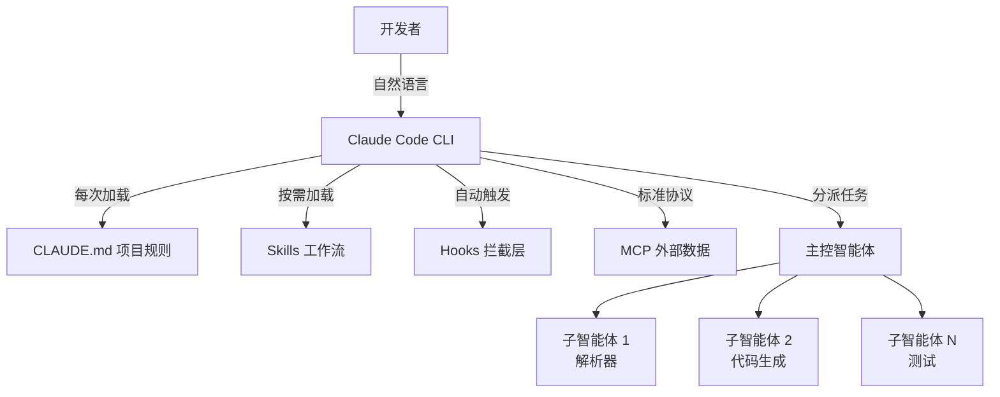

# 你不知道的 Claude Code：五层扩展架构、上下文陷阱与实战踩坑

**一句话总结：** Claude Code 不是聊天机器人，是一套五层可组合的代码基础设施。**16 个智能体花 2 万美元写出了能编译 Linux 内核的 C 编译器**——但让这件事成为可能的不是模型本身，而是 CLAUDE.md、Skills、Hooks、MCP、Agent Teams 这五层架构的组合。大多数人卡在第一层就放弃了。

## 背景

刚接触 **[Claude Code](/glossary/claude-code)** 的时候，大部分人（包括我们）都把它当成一个更强的 ChatBot 来用：问一句答一句，写一段代码粘贴一下。用了一段时间才意识到不对劲——上下文越来越乱、给的工具越来越多但输出越来越不稳定、CLAUDE.md 规则越写越长却越不遵守。

这种体验几乎每个早期用户都经历过。你花 30 分钟写了一份详细的 CLAUDE.md，列了 50 条规则——命名规范、错误处理模式、测试覆盖率要求——结果 AI 在第三轮对话就开始"选择性遵守"。不是因为它忘了，是因为 50 条规则占了太多上下文空间，推理质量被挤压了。你本能的反应是加更多规则来纠正，这恰好让问题更严重。

问题不是模型不够聪明，而是没有理解这套系统的设计意图。

2025 年 2 月 Claude Code 以命令行工具上线时，Anthropic 的目标就不是做一个编程助手——他们要造的是一套可组合、可配置的[智能体](/glossary/agentic-coding)基础设施。这个定位决定了它的上限完全不同：编辑器里的 AI 受编辑器的扩展模型限制，而基础设施没有天花板。你可以把 build 日志管道化输入、在 CI/CD 里无头运行、和 `jq`、`grep` 链式调用。一个 Cursor Tab 补全做不到的事——比如扫描整个代码库找出所有不符合新 API 契约的调用点，然后批量修改、跑测试、提 PR——Claude Code 加一个 Skill 就能搞定。

这也是为什么到 2025 年 7 月，Claude Code [收入暴涨了 5.5 倍](https://techcrunch.com/2026/02/05/anthropic-releases-opus-4-6-agent-teams/)——微软、Google、甚至 OpenAI 的工程师都在用竞对的工具，靠的不是品牌忠诚度，而是架构本身解决了其他工具解决不了的问题。

## 发生了什么

过去一年，这套扩展栈分五个阶段组装完成：

- **2025 年 2 月：** CLI 预览版上线，核心原语 `CLAUDE.md` 已经在了——项目级配置文件，每次会话启动时加载
- **2025 年 5 月：** GA 发布 + **[MCP](/glossary/mcp)** 协议（Model Context Protocol）同步上线，用开放标准替代各家的插件体系
- **2025 年 7-10 月：** Skills 和 Hooks 成熟，团队可以用声明式配置控制 AI 工作流
- **2025 年 12 月：** NASA 工程师用 Claude Code [规划火星车"毅力号"的 400 米路线](https://www.anthropic.com/research/claude-on-mars)——太空探索中首次已知的 AI 编程智能体应用
- **2026 年 2 月 5 日：** Claude Opus 4.6 发布，引入 **Agent Teams**
- **2026 年 2 月 9 日：** 安全研究员 Nicholas Carlini 用 [16 个智能体协同写出一个完整的 C 编译器](https://www.theregister.com/2026/02/09/claude_opus_c_compiler/)，能编译 Linux 内核，计算成本约 $20,000

NASA 的案例是可靠性里程碑。当航天工程师愿意把一台 27 亿美元的火星车交给 AI 编程智能体做路径规划，说明这东西的可靠性已经远超 demo 级别。而 Carlini 的编译器实验则是复杂度里程碑——一个能通过 Linux 内核编译的 C 编译器涉及词法分析、语法解析、语义分析、IR 生成、优化器、代码生成器等十几个紧密耦合的模块，这已经超出了"一个 AI 写代码"的范畴，进入了"多个 AI 协同做系统工程"的领域。

## 怎么实现的

把 Claude Code 理解为单一工具是最常见的误区。它其实是五层叠加的系统，每层解决一个不同的问题，层与层之间独立但可组合：

| 层 | 做什么 | 解决什么问题 | 典型误用 |
|---|---|---|---|
| **CLAUDE.md** | 项目级持久契约 | 每次会话都成立的规则、边界、禁止项 | 写成团队知识库，几千行塞进去，上下文先污染自己了 |
| **Skills** | 按需加载的工作流 | 给 AI 一套"方法包"——怎么审 PR、怎么部署、怎么迁移 | 一个 Skill 塞五种任务，或正文太长把上下文撑爆 |
| **Hooks** | 强制执行的拦截层 | 不依赖 AI 自觉的硬性规则——格式化、lint、阻断危险操作 | 用 Hook 替代所有需要推理的判断 |
| **MCP** | 外部系统连接协议 | 让 AI 读 Jira 看板、Slack 对话、Google Drive、自建系统 | 接太多 Server，光工具定义就吃掉 12.5% 上下文 |
| **Agent Teams** | 多智能体并行执行 | 大型可分解任务——编译器、大规模重构、多模块同步开发 | 无边界 fan-out，子智能体权限和主线程一样宽 |

> 简单记：新动作能力用 Tool/MCP，给 AI 一套工作方法用 Skill，强制约束和审计用 Hook，需要隔离执行环境用 Subagent。

下面拆开讲每一层。

### CLAUDE.md：契约不是文档

很多人把 CLAUDE.md 当成团队 wiki 来写——项目背景、API 文档、设计理念统统塞进去。结果文件到了几千行，AI 每次会话都要读全文，有用的规则被大量背景信息淹没了。

**正确做法是只放每次会话都必须成立的命令**：怎么 build、怎么 test、绝对不能干的事、架构边界。Anthropic 自己的 CLAUDE.md 大约只有 2,500 tokens。大段参考资料应该拆到 Skills 的 supporting files 里，按需加载而不是常驻。

因为 CLAUDE.md 是 Git 版本控制的，`git clone` 的时候 AI 的行为规则会跟着代码一起走。一个文件管全局，团队里每个智能体（包括子智能体）都会继承这些规则。还有一个很多人忽略的分层机制：`~/.claude/CLAUDE.md`（全局偏好）→ 项目根目录 `CLAUDE.md`（项目规则）→ `.claude/rules/*.md`（路径级和语言级规则）。全局放个人习惯（"我用 vim 键位"），项目级放 build 命令和架构约束，rules 目录放"改 Python 文件时跑 mypy"这类条件规则。层次搞清楚，每层都很短。

**反模式清单：**

- 把 API 文档原文粘进去（应该让 AI 用 Read 工具按需读取文件）
- "尽量写好的代码"这种模糊指令（AI 无法执行，浪费 token）
- 规则自相矛盾（"用最少的代码实现"vs"必须处理所有边界情况"）
- 超过 3,000 tokens——已经进入上下文污染区了

### Skills：不是模板库，是按需加载的方法论

Skills 和 Cursor 的系统提示词有本质区别：它是文件级的（`skills/*/SKILL.md`），走 Git 版本控制，可以 Code Review，团队共享。技术上更接近"封装好的 Prompt 包"，但带有输入输出规范和 few-shot 示例。

关键设计是**按需加载**——描述符常驻上下文（几十个 token），完整内容只在触发时才拉进来。这个机制叫"渐进式披露"（progressive disclosure），解决的是上下文空间有限的问题。一个中型项目可能有 15-20 个 Skills，如果全部常驻上下文，光 Skill 内容就要占 30K-50K tokens。按需加载后，固定成本降到描述符的 300-500 tokens。

使用策略：

| 使用频率 | 做法 | 原因 |
|---------|------|------|
| 高频（>1 次/会话） | 保持 auto-invoke，优化描述符长度 | 减少手动触发成本 |
| 低频（<1 次/会话） | 设置 disable-auto-invoke，手动触发 | 描述符完全脱离上下文 |
| 极低频（<1 次/月） | 移除 Skill，改写进文档 | 不值得占用任何上下文 |

**写好 Skill 描述符的关键：** `description: help with backend` 是个反面教材——这种描述任何后端任务都能触发，选择率暴跌。描述符要写"**何时该用我**"，不是"我是干什么的"。好的描述符：`description: 当用户要求 review PR 或代码审查时使用。不要用于写新代码。` 这样 AI 就能精准匹配意图。

另一个常见错误是 Skill 正文太长。一个 Skill 一旦被触发，全部内容会加载进上下文。如果正文有 8,000 tokens，等于一次性吃掉 4% 的上下文窗口。把大 Skill 拆成主文件 + supporting files（`skills/review/SKILL.md` + `skills/review/checklist.md`），主文件写流程骨架，AI 需要细节时再 Read supporting files。

### Hooks：强制执行，不靠 AI 自觉

Hooks 在 AI 操作的前后自动执行 Shell 命令。编辑文件后自动跑 Prettier 格式化，提交前自动跑 ESLint，修改受保护文件时直接阻断。

不靠 Hook 的话，Claude 经常"忘了"跑格式化，或者改了不该改的文件。CLAUDE.md 里写了"提交前必须通过测试"不代表它每次都会照做——Hook 把这个从"期望"变成"强制"。这个区别在长会话中尤为明显：会话到了第 15 轮，上下文已经很拥挤，AI 跳过非核心步骤的概率显著上升。Hook 不受上下文影响，第 1 轮和第 50 轮一样可靠。

Hook 有四个挂载点：`PreToolUse`（工具调用前）、`PostToolUse`（工具调用后）、`Notification`（任务完成通知）、`Stop`（会话结束时）。一个实用配置示例：

- `PostToolUse` + `Edit` → 自动跑 `prettier --write` 格式化刚编辑的文件
- `PreToolUse` + `Bash` → 检查命令是否包含 `rm -rf /` 或 `DROP TABLE`，包含则 `exit 2` 阻断
- `Stop` → 发 Slack 通知"Claude 完成了任务"
- `PreToolUse` + `Edit` → 如果目标文件在 `migrations/` 目录下，阻断并提示需要人工审核

适合 Hook 的：格式化、lint、轻量校验、阻断危险操作、任务完成推送通知。不适合 Hook 的：需要读大量上下文的语义判断、多步推理、长时间运行的流程（超过几秒的操作会阻塞 AI 的工作流）——这些应该放在 Skill 或 Subagent 里。

### MCP：外部数据接入的开放标准

[MCP](/glossary/mcp)（Model Context Protocol）让 Claude Code 通过标准化协议访问外部系统——Jira、Slack、Google Drive、GitHub、甚至自建内部工具。和传统插件的区别类似 USB-C 和各品牌专用充电线的区别：一个统一接口，任何第三方都可以写 MCP Server。

但有一个很多人没意识到的成本：一个典型 MCP Server（比如 GitHub）包含 20-30 个工具定义，每个约 200 tokens，合计 **4,000-6,000 tokens**。接 5 个 Server，光这部分固定开销就到了 **25,000 tokens——占 200K 上下文窗口的 12.5%**。在需要读大量代码的场景，这 12.5% 的损失很关键。

**MCP 成本管理策略：**

- **延迟加载（defer_loading）：** Claude Code 原生支持，只发送轻量级 stub（几十 tokens），模型需要时才拉取完整 schema。这应该是所有非高频 MCP Server 的默认配置
- **项目级 vs 全局级：** 只在当前项目需要的 Server 配在 `.claude/settings.json`，通用的（如 filesystem）配在全局。避免每个项目都加载所有 Server
- **自定义 Server 精简工具集：** 如果你只需要 GitHub 的 `create_pull_request` 和 `list_issues`，不要接完整的 GitHub MCP Server（30+ 工具）。写一个只暴露 2-3 个工具的轻量 Server

### Agent Teams：隔离比并行更重要

2026 年 2 月随 Opus 4.6 引入。通过 Agent SDK，一个主控智能体把大任务拆成子任务，分配给多个子智能体并行执行。Carlini 的编译器实验就是 16 个子智能体各写一个模块——解析器、代码生成器、测试——主控负责协调和合并。

但 Agent Teams 的核心价值不是"并行"，是**隔离**。扫代码库、跑测试、做审查这类会产生大量中间输出的任务，交给子智能体做，主线程只拿摘要，不会被中间过程污染上下文。一个子智能体跑完测试可能产生 10,000 tokens 的输出，但返回给主控的摘要只有 200 tokens。这就是上下文隔离的价值——10,000 tokens 的中间态被封装在子进程里，永远不会污染主线程。

| 适合 Agent Teams | 不适合 Agent Teams |
|-----------------|-------------------|
| 大型可分解任务（编译器、大规模重构） | 聚焦的单文件修改、简单 Bug 修复 |
| 多个独立模块同步开发 | 子任务之间有强依赖，需要频繁共享状态 |
| 产生大量中间输出的研究/扫描 | 不需要隔离的简单操作 |
| 需要不同工具权限的并行任务 | 所有子任务需要完全一致的上下文 |

**配置子智能体的关键原则：**

1. **最小权限：** 用 `disallowedTools` 约束每个子智能体只能使用它需要的工具。"测试智能体"不需要 Write 权限，"审查智能体"不需要 Bash 权限
2. **最大轮次：** 设定 `maxTurns` 防止子智能体陷入无限循环。一般 10-20 轮足够完成一个独立子任务
3. **文件隔离：** 多个子智能体同时写文件会冲突。用 `isolation: worktree` 让每个子智能体在自己的 git worktree 里工作，主控负责合并
4. **显式输出格式：** 在子智能体的 prompt 里明确要求"完成后输出一份 200 字以内的摘要"，否则它可能把整个执行过程原封不动返回给主控

子智能体权限和主线程一样宽是最常见的反模式——如果子智能体能做主线程能做的一切，那隔离就没有意义，风险反而被放大了。

## 为什么重要

这套架构重新定义了"开发工具"的边界。

经济账最直接。16 个智能体花 2 万美元、几个小时写出一个 C 编译器。同样的工作交给资深工程师团队，可能需要数周到数月。这不是边际效率优化——是软件工程成本结构的根本性变化。不会替代架构设计和系统思维，但设计确定之后的执行成本会被大幅压缩。

更深层的影响在组织层面。当一个初创团队的 3 个工程师配合 Agent Teams 能达到以前 15 人团队的执行力，"最小可行团队"的规模会急剧缩小。这意味着更多的技术项目变得经济可行——以前因为人力成本太高而放弃的项目，现在可以 2 万美元做一个原型出来。

对国内开发者而言，直接使用有网络和 API 门槛，但架构思路是通用的。通义灵码已经支持自定义指令，Cursor 有 Rules 文件，MCP 协议本身是开放标准，国产工具也在逐步接入。目前还没有谁实现了这种层级化的扩展栈——理解五层架构的设计逻辑，对评估和选择下一代 AI 编程工具有直接帮助。

## 风险与局限

五层架构组合性越强，错误传播也越快。一条写错的 CLAUDE.md 规则会被团队里每个智能体继承——Carlini 的 16 个智能体实验里，如果项目规则有错，16 个智能体会同时复制这个错误，成本乘以 16。

安全是绕不过去的问题。2025 年 8 月，黑客 GTG-2002 把 Claude Code 武器化用于网络攻击。一个能跑任意 Shell 命令、控制 Git、连接企业系统的 AI 智能体，天然就是双刃剑。Anthropic 在 2026 年 2 月推出了 [Claude Code Security](https://www.anthropic.com/news/responsible-scaling-policy-v3) 和 Responsible Scaling Policy v3.0 作为应对，但底层矛盾不会消失——给 AI 能力越大，攻击面也越大。

代码质量是更安静的风险。Carlini 自己承认编译器代码没做优化。智能体生成代码的速度可以远超任何人类 reviewer 的审查速度——如果团队在没有充分 Code Review 的情况下大规模采用，本质上是在用速度换技术债务。一个实用的防护策略：在 Hook 里挂一个 `git diff --stat` 检查，单次变更超过 500 行时自动阻断并要求人工 review。

供应链风险也值得关注。MCP Server 目前没有官方的签名和审计机制，任何人都可以发布。一个恶意的 MCP Server 可以在工具定义里注入 prompt injection，让 AI 执行意料之外的操作。在接入第三方 MCP Server 之前，审查源码是必要的。

## 常见问题

### CLAUDE.md 到底该写多长？

越短越好。Anthropic 自己的 CLAUDE.md 大约 2,500 tokens。只放每次会话都必须成立的命令：build/test 怎么跑、架构边界、绝对不能干的事。大段参考资料拆到 Skills 的 supporting files，路径或语言级别的规则用 `.claude/rules/` 目录。记住 CLAUDE.md 的每个 token 都是常驻上下文的固定成本。

### 上下文用完了怎么办？

先用 `/context` 看消耗分布。常见原因：MCP Server 工具定义占了 12%+、CLAUDE.md 太长、长会话累积的中间输出。任务切换用 `/clear`（彻底清空），同一任务进阶段用 `/compact`（压缩历史）。更主动的方案：让 Claude 写一份 HANDOFF.md 记录当前进度，然后开新会话继续。一个经验值：当上下文使用率超过 60%，推理质量会开始下降。

### Agent Teams 适合什么场景，什么时候不该用？

适合大型可分解任务——编译器、重构大代码库、同时实现多个独立模块。不适合聚焦的单文件修改、简单 Bug 修复、代码审查——单个智能体配好 Skills 和 Hooks 更快更便宜。多智能体有协调开销，子任务之间有依赖关系时效率可能不升反降。一个判断标准：如果任务能在 20 分钟内用单个智能体完成，就不需要 Agent Teams。

### 国内开发者能用吗？

直接使用需要科学上网和 Anthropic API key。但五层架构的设计思路——配置文件化（CLAUDE.md）、工作流封装（Skills）、操作自动化（Hooks）、外部数据标准化接入（MCP）——是通用模式。通义灵码、Cursor、豆包 MarsCode 都在往 Agentic 方向演进，理解这套架构有助于你在现有工具上复现类似能力。MCP 协议是开放标准，已经有国内团队在做兼容实现。

### 怎么评估我的团队是否该引入这套工具？

三个前提条件：（1）团队已经有基本的 CI/CD 和代码审查流程——没有自动化基础就引入 AI 自动化是在放大混乱；（2）至少有一个人愿意花 2-3 周时间做"AI 工程师"，负责写 CLAUDE.md、调试 Skills、配置 Hooks；（3）领导层理解这不是"装了就提效"，需要持续调优。满足这三个条件，从一个低风险项目（比如测试生成、文档更新）开始试点，积累经验后再推广到核心业务代码。

## 参考资料

- [Anthropic releases Opus 4.6 with new 'agent teams'](https://techcrunch.com/2026/02/05/anthropic-releases-opus-4-6-agent-teams/) — TechCrunch, 2026-02-05
- [Claude Opus 4.6 spends $20K trying to write a C compiler](https://www.theregister.com/2026/02/09/claude_opus_c_compiler/) — The Register, 2026-02-09
- [Claude on Mars](https://www.anthropic.com/research/claude-on-mars) — Anthropic, 2026-01-30
- [Responsible Scaling Policy Version 3.0](https://www.anthropic.com/news/responsible-scaling-policy-v3) — Anthropic, 2026-02-24
- [Claude Code 官方文档](https://docs.anthropic.com/en/docs/claude-code) — Anthropic, 2026-03-01

**相关阅读**：[今日简报](/newsletter/2026-03-12) 有更多 AI 动态。另见：[MCP 与 CLI 与 Skills：如何扩展 Claude Code](/blog/mcp-vs-cli-vs-skills-extend-claude-code)、[Claude Code Agent Teams 详解](/blog/claude-code-agent-teams)。

---

*觉得有用？[订阅 AI 简报](/subscribe)，每天 5 分钟掌握 AI 动态。*
