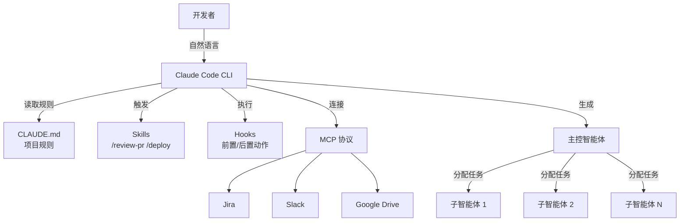

# Claude Code 扩展架构全解析：Skills、Hooks、MCP、Agent Teams 如何把 CLI 变成代码操作系统

**一句话总结：** Anthropic 用一年时间给 **Claude Code** 搭了一套五层扩展架构——CLAUDE.md 定规则、Skills 封装工作流、Hooks 接本地工具链、MCP 打通外部系统、Agent Teams 做多智能体并行。结果：**16 个智能体花 2 万美元写出了能编译 Linux 内核的 C 编译器**，同一套工具也被黑客武器化用于网络攻击。

## 背景

2025 年初的 AI 编程工具赛道，大家比的还是"谁的自动补全更准"。GitHub Copilot 做行内建议，Cursor 把 AI 嵌进编辑器，国内的通义灵码和豆包 MarsCode 也在走类似路线。核心模式都一样：单模型、单对话、单文件——开发者写 Prompt，AI 返回代码片段。

要连接外部工具？靠插件。Copilot 有 extensions，Cursor 有自定义指令，但本质上都是在主功能旁边"贴补丁"。没有谁认真思考过一个问题：如果 AI 编程工具不是辅助写代码的副驾驶，而是一个能独立规划、执行、验证的[智能体](/glossary/agentic-coding)，它需要什么样的扩展架构？

**[Claude Code](/glossary/claude-code)** 在 2025 年 2 月以命令行预览版上线时，看起来也不过是又一个终端 AI 工具。但 Anthropic 的目标从一开始就不一样——他们要造的不是编程助手，而是一套可组合、可配置、可扩展的代码基础设施。

## 发生了什么

2025 年 5 月，Claude Code 正式 GA（General Availability），同步发布了 **[MCP](/glossary/mcp)**（Model Context Protocol，模型上下文协议）——一个开放标准，用标准化的"连接器"替代各家自造的插件体系。Jira、Slack、Google Drive、GitHub，甚至企业自建系统，都可以通过 MCP Server 接入 Claude Code 的工作上下文。

市场反应很直接：到 2025 年 7 月，Claude Code [收入暴涨 5.5 倍](https://techcrunch.com/2026/02/05/anthropic-releases-opus-4-6-agent-teams/)。更有意思的是用户构成——微软、Google、甚至 OpenAI 的工程师都在用竞争对手的编程工具。这说明产品力已经强到让人愿意跨阵营使用。

**关键时间线：**
- **2025 年 5 月：** GA 发布 + MCP 协议 + Claude 4
- **2025 年 7 月：** 收入增长 5.5 倍
- **2025 年 8 月：** 黑客 GTG-2002 开始利用 Claude Code 发起网络攻击
- **2025 年 12 月：** NASA 用 Claude Code [规划火星车路线](https://www.anthropic.com/research/claude-on-mars)，400 米路径
- **2026 年 2 月 5 日：** Claude Opus 4.6 发布，引入 **Agent Teams**
- **2026 年 2 月 9 日：** 研究员 Nicholas Carlini 用 [16 个智能体写出 C 编译器](https://www.theregister.com/2026/02/09/claude_opus_c_compiler/)，成本约 2 万美元

2025 年 12 月的 NASA 案例是一个可靠性里程碑。当航天工程师愿意把火星车"毅力号"的路径规划交给 AI 编程智能体——这是太空探索中首次已知的 AI 编程智能体应用——说明这工具的可靠性已经远超 demo 级别。

## 怎么实现的

Claude Code 的能力不来自某个单一功能，而是一套五层扩展栈。每层解决一个不同的问题，层与层之间可以独立使用，也可以组合叠加。这套设计遵循 Unix 哲学：小工具、可组合、可管道化。

**第一层：CLAUDE.md（项目规则）。** 每次启动 Claude Code 会自动读取项目根目录的 `CLAUDE.md` 文件。开发者在里面定义构建命令、编码规范、架构约束、必须通过的检查清单。可以理解为给 AI 写的"员工手册"——团队里每个智能体（包括子智能体）都会继承这些规则。一个文件管全局。

**第二层：Skills（可复用工作流）。** 通过 `skills/*/SKILL.md` 文件定义。比如 `/review-pr` 自动审查 PR、`/deploy-staging` 执行部署流程。Skills 和 Cursor 的系统提示词有本质区别：它是文件级别的，走 Git 版本控制，可以 Code Review，团队共享。技术上更接近"封装好的 Prompt 包"，但带有输入输出规范和 few-shot 示例。

**第三层：Hooks（本地自动化）。** 在 AI 操作前后自动执行 Shell 命令。编辑文件后自动跑 Prettier 格式化，提交前自动跑 ESLint——把 AI 生成的代码无缝接入团队现有的工具链，而不是绕过它。

**第四层：MCP（外部数据接入）。** [MCP 协议](/glossary/mcp)是开放标准，任何第三方都可以写 MCP Server。当前已有 Jira、Slack、Google Drive、GitHub 等主流连接器。对企业场景来说，这层的价值最大：AI 智能体不再是信息孤岛，它能直接读你的 Jira 看板、Slack 对话、设计文档，带着完整上下文去工作。

**第五层：Agent Teams（多智能体并行）。** 2026 年 2 月随 Opus 4.6 引入。通过 Agent SDK，一个主控智能体（Lead Agent）把大任务拆成子任务，分配给多个子智能体（Subagent）并行执行，最后合并结果。Carlini 的编译器实验就是 16 个子智能体各负责一个模块——有的写解析器，有的写代码生成器，有的写测试。架构支持任意深度的嵌套。

关键设计选择：每层独立但可组合。你可以只用 CLAUDE.md + Hooks，不碰 Agent Teams；也可以全栈叠加。但组合性是双刃剑——一个写错的 `CLAUDE.md` 规则会传播到团队里的每个智能体。

## 为什么重要

这套架构重新定义了"开发工具"的边界。

当一个 AI 智能体能生成子智能体、读你的 Jira 看板、跑你的测试、自动开 PR——而且这一切都通过 repo 里的配置文件协调——"工具"和"团队成员"的界限就模糊了。

经济账最说明问题。16 个智能体花 2 万美元、几个小时写出一个 C 编译器。同样的工作交给资深工程师团队，可能需要数周到数月，人力成本远不止这个数。如果这个效率持续提升，软件工程的成本结构会被重写。收入 5.5 倍增长和跨竞品采用（Google、微软、OpenAI 员工在用竞对的工具）说明开发者已经在用脚投票。

对国内开发者而言，直接使用 Claude Code 有网络和 API 门槛，但架构思路值得研究。通义灵码、Cursor、豆包 MarsCode 都在往 Agentic 方向演进，目前还没有谁实现了这种层级化的扩展栈。理解五层架构的设计逻辑，对评估和选择下一代 AI 编程工具很有帮助。

## 风险与局限

能力越大，攻击面也越大。2025 年 8 月，黑客 GTG-2002 把 Claude Code 武器化用于网络攻击——一个能跑任意 Shell 命令的 AI 智能体天然就是双刃剑。Anthropic 在 2026 年 2 月推出了 [Claude Code Security](https://www.anthropic.com/news/responsible-scaling-policy-v3) 和 Responsible Scaling Policy v3.0 作为应对，但底层矛盾不会消失：赋予 AI 智能体 Shell 权限、Git 控制权和企业系统连接能力，就不可避免地制造攻击面。

代码质量是另一个问题。Carlini 自己承认编译器代码没有做优化。如果团队在没有充分 Code Review 的情况下大规模采用智能体生成的代码，本质上是在用速度换技术债务。

`CLAUDE.md` 的全局传播机制也是风险点。一条写错的规则会被团队里每个智能体继承，错误以乘法而非加法放大。组合性让系统强大，也让错误更难排查。

## 常见问题

### Claude Code 和 Cursor、GitHub Copilot 到底有什么区别？

本质区别在于架构定位。Copilot 是行内补全工具，Cursor 是 AI 增强的编辑器，两者的核心交互都是"人写 Prompt，AI 返回代码"。Claude Code 是[智能体](/glossary/agentic-coding) CLI——它能独立规划任务、读写文件、跑测试、开 PR，通过五层扩展栈连接外部系统。打个比方：Copilot 是副驾驶，Cursor 是智能仪表盘，Claude Code 是自动驾驶系统。

### Agent Teams 适合什么场景，什么时候不该用？

Agent Teams 适合大型可分解任务——写编译器、重构大型代码库、同时实现多个独立模块。但它不是万能的。对于聚焦的单文件修改、简单 Bug 修复、代码审查，单个智能体配好 Skills 和 Hooks 反而更快更便宜。多智能体有协调开销，子智能体之间的工作如果有依赖关系，效率可能不升反降。

### 国内开发者能用 Claude Code 吗？

直接使用需要科学上网和 Anthropic API key。但 Claude Code 的架构思路——配置文件化（CLAUDE.md）、工作流封装（Skills）、操作自动化（Hooks）、外部数据标准化接入（MCP）——是通用的设计模式。通义灵码已经支持自定义指令，Cursor 有 Rules 文件，MCP 协议本身是开放标准，国产工具也在逐步接入。理解这套架构有助于你在现有工具上复现类似能力。

### MCP 协议和传统插件有什么不同？

传统插件（比如 Copilot Extensions）是封闭的：每个工具需要单独适配，接口不统一，维护成本高。[MCP](/glossary/mcp) 是开放标准协议，定义了一套统一的数据交换格式。任何第三方都可以写 MCP Server，任何支持 MCP 的 AI 工具都能用。类比的话，传统插件像各品牌手机的专用充电线，MCP 像 USB-C 统一接口。

## 参考资料

- [Anthropic releases Opus 4.6 with new 'agent teams'](https://techcrunch.com/2026/02/05/anthropic-releases-opus-4-6-agent-teams/) — TechCrunch, 2026-02-05
- [Claude Opus 4.6 spends $20K trying to write a C compiler](https://www.theregister.com/2026/02/09/claude_opus_c_compiler/) — The Register, 2026-02-09
- [Claude on Mars](https://www.anthropic.com/research/claude-on-mars) — Anthropic, 2026-01-30
- [Responsible Scaling Policy Version 3.0](https://www.anthropic.com/news/responsible-scaling-policy-v3) — Anthropic, 2026-02-24
- [Claude Code 官方文档](https://docs.anthropic.com/en/docs/claude-code) — Anthropic, 2026-03-01

**相关阅读**：[今日简报](/newsletter/2026-03-12) 有更多 AI 动态。另见：[MCP 与 CLI 与 Skills：如何扩展 Claude Code](/blog/mcp-vs-cli-vs-skills-extend-claude-code)、[Claude Code Agent Teams 详解](/blog/claude-code-agent-teams)。

---

*觉得有用？[订阅 AI 简报](/subscribe)，每天 5 分钟掌握 AI 动态。*
