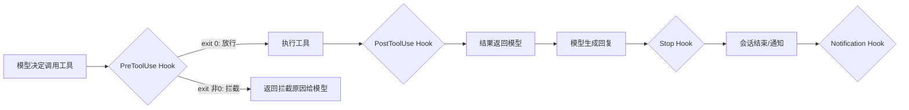
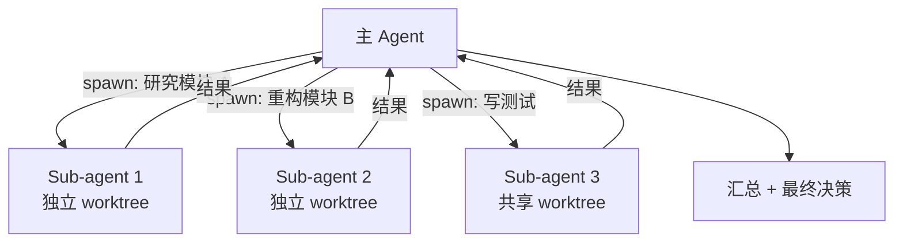
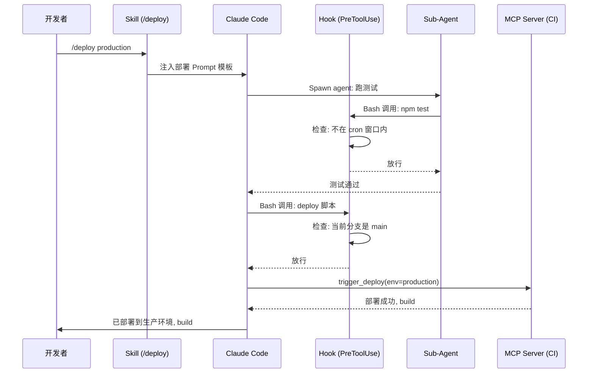

# Claude Code 扩展栈拆解：Skills、Hooks、Agents、MCP 四层架构实战

**一句话总结：** Anthropic 在 **Claude Code** 里埋了四个扩展原语 — Skills、Hooks、Agents、MCP — 不是插件系统，是把 AI 编程助手变成**可编程开发平台**的完整架构层。搞懂这四层怎么组合，才是用好 Claude Code 的关键。

## 背景

刚上手 Claude Code 的时候，我也当它是个更强的终端 ChatBot：问问题、改代码、跑命令。用了两三周开始撞墙 — **CLAUDE.md** 越写越长，上下文污染越来越严重；想让它"每次改完文件自动跑 lint"，只能在对话里反复提醒；团队里三个人各有一套 Prompt 习惯，没法统一。

这些问题的共同根因不是模型不够聪明，而是**没有把工作流固化到代码里**。

AI 编程工具的演化路径很眼熟：自动补全 → 对话 → 工具集成。Cursor、Copilot、Windsurf 都在走同一条路。但集成层通常是后加的 — 一个 API 调用接口、一个插件市场、一堆 JSON 配置。Claude Code 2025 年 2 月发布时，Anthropic 做了一个不太一样的选择：**扩展机制和核心 Agent 同时设计**，不是事后补丁。

结果就是现在的四层栈：Skills、Hooks、Agents、[MCP](/glossary/mcp-server)。每层解决一类问题，组合起来能覆盖从个人习惯到团队规范再到外部系统集成的全部需求。

## 发生了什么

**Claude Code** 的扩展栈不是一次发布的，而是在 2025 年 2 月到 2026 年初逐步成型：

- **2024 年 11 月**：Anthropic 发布 [MCP（Model Context Protocol）](https://modelcontextprotocol.io)开放标准，定义 AI 工具与外部数据源的通信协议
- **2025 年 2 月**：Claude Code 以终端原生 AI 编程 Agent 的形态发布，内置 CLAUDE.md 项目配置和基础工具链
- **2025 年中**：Skills（`.claude/commands/` 目录）和 Hooks（生命周期拦截）机制上线
- **2026 年初**：Sub-agent 系统成熟，支持最多 **10 个并行 Agent**，每个可在独立 git worktree 中运行

截至目前，MCP 生态已有 **1000+ 社区构建的集成**，覆盖数据库、CI/CD、文档系统、内部工具等场景。这让 Claude Code 成为当前 AI 工具连接外部系统最广泛的开放标准实现。

**关键参数：**
- **扩展层数：** 4（Skills、Hooks、Agents、MCP）
- **Hook 生命周期事件：** 4 个（PreToolUse、PostToolUse、Notification、Stop）
- **最大并行 Agent 数：** 10
- **MCP 社区集成：** 1000+
- **Skills 存储位置：** `.claude/commands/*.md`（项目级）或 `~/.claude/commands/*.md`（全局）

## 怎么实现的

### 四层扩展机制对比

先用表格看全貌，再逐个拆解：

| 扩展层 | 存储位置 | 运行时角色 | 解决什么问题 | 典型误用 |
|--------|---------|-----------|-------------|---------|
| **Skills** | `.claude/commands/*.md` | 按需注入的 Prompt 模板 | 复用工作流，统一团队做法 | 一个 Skill 塞五种任务；Skill 写太长超过 2000 Token |
| **Hooks** | `.claude/settings.json` | 确定性拦截器 | 强制执行规则，不依赖模型"自觉" | 用 Hook 替代所有判断逻辑；忽略 Hook 静默失败 |
| **Agents** | 运行时动态 spawn | 隔离的子进程 | 并行执行、上下文隔离 | 10 个 Agent 同时跑烧完预算；不设 scope 权限 |
| **MCP** | settings 或 `.mcp.json` | 外部工具协议层 | 连接数据库、CI、文档等外部系统 | 接太多 Server 导致 Token 开销爆炸 |

> 简单记：**复用方法用 Skill，强制约束用 Hook，隔离并行用 Agent，连接外部用 MCP**。

### Skills：把经验变成代码

**Skills** 是 Markdown 文件，放在 `.claude/commands/` 目录下，通过 `/` 斜杠命令调用。

```markdown
<!-- .claude/commands/review-pr.md -->
Review the current PR changes:
1. Run `git diff main...HEAD` to see all changes
2. Check for security issues (SQL injection, XSS, hardcoded secrets)
3. Verify test coverage for new functions
4. Output a structured review with severity ratings
```

保存后在 Claude Code 里输入 `/review-pr` 就能触发。

**项目级 Skills**（放在 `.claude/commands/`）会随代码库版本控制 — `git push` 之后团队所有人自动拥有同样的工作流。**个人级 Skills**（放在 `~/.claude/commands/`）只对自己生效。

常踩的坑：

- **Skill 写太长**。一个 Skill 超过 1500-2000 Token，注入上下文的开销就开始影响模型对当前任务的理解。每个 Skill 应该聚焦解决**一个**工作流。
- **把 Skill 当 CLAUDE.md 用**。CLAUDE.md 是每次会话都加载的"项目契约"，Skill 是按需调用的"方法论"。CLAUDE.md 放规则（"commit message 用中文"），Skill 放流程（"怎么做 code review"）。
- **不区分项目级和个人级**。团队共用的标准流程放项目目录版本控制，个人偏好放 `~/` — 混用会导致其他人 clone 仓库后被塞进不需要的工作流。

决策规则：**高频动作（>3 次/周）→ 写成 Skill。低频但关键（如部署、发布）→ 也写成 Skill。一次性任务 → 直接在对话里说。**

### Hooks：给 AI 装刹车

Hooks 是 Claude Code 最容易被低估的扩展层。它在 4 个生命周期节点执行 shell 命令：



关键点：**Hook 是确定性的**。它不依赖模型"记住"规则，而是在工具调用层面物理拦截。模型想往生产数据库写数据？PreToolUse Hook 检查 SQL 里有没有 `production` 关键字，有就直接 block — 不管模型怎么"想"。

配置示例（`.claude/settings.json`）：

```json
{
  "hooks": {
    "PreToolUse": [
      {
        "matcher": "Bash",
        "command": "echo \"$CLAUDE_TOOL_INPUT\" | python3 check_dangerous_commands.py"
      }
    ],
    "PostToolUse": [
      {
        "matcher": "Edit",
        "command": "npm run lint -- --fix $CLAUDE_FILE_PATH"
      }
    ]
  }
}
```

常踩的坑：

- **Hook 静默失败**。如果 Hook 脚本本身有 bug（比如 Python 脚本 import 报错），它可能返回 exit 0（通过），但实际上什么检查都没做。团队会误以为"有 Hook 在守着"，实际上门是开的。**解决方案：Hook 脚本本身要有测试，而且 PostToolUse 可以加一个"验证 PreToolUse Hook 确实执行了"的二次检查。**
- **过度依赖 Hook**。Hook 只能拦截**工具调用**，不能拦截模型在文本输出中"建议"的危险操作。用户看到建议手动执行了，Hook 管不到。它是安全层，不是完整的安全边界。

决策规则：**必须 100% 执行的规则 → 用 Hook。最好遵守但偶尔可以绕过的 → 写在 CLAUDE.md。模型判断力能覆盖的 → 不需要 Hook。**

### Agents：并行执行的隔离沙箱

Claude Code 可以在一个会话内 spawn 最多 **10 个 Sub-agent**，每个有独立的上下文窗口，可选在独立 git worktree 中运行。



**worktree 隔离**是关键设计。每个 Agent 在独立的 git 分支上工作，互不影响。Agent 2 在重构文件的时候，Agent 1 还在读同一个文件的旧版本 — 不会冲突。完成后由主 Agent 决定怎么合并。

常踩的坑：

- **成本失控**。10 个并行 Agent，每个消耗独立的上下文窗口。一个 200K Token 的窗口，10 个就是 2M Token。按 Claude Sonnet 输入 $3/百万 Token 计算，一次并行研究任务可能花 $6-10 光输入成本。**建议：并行 Agent 数量控制在 3-5 个，只在真正需要并行的场景使用。**
- **不设权限范围**。Sub-agent 可以配置 scoped permissions — 限制它只能读不能写，或者只能操作特定目录。不设权限，一个研究型 Agent 意外改了生产代码就麻烦了。

决策规则：**任务之间无依赖 + 每个任务 >5 分钟 → 用并行 Agent。任务有先后依赖 → 顺序执行。快速查询（<1 分钟）→ 直接在主 Agent 做，不值得 spawn 的开销。**

### MCP：连接一切的协议层

[MCP（Model Context Protocol）](/glossary/mcp-server)是 Anthropic 2024 年 11 月发布的开放标准，定义了 AI 工具和外部系统之间的通信协议。用 JSON-RPC 通信，支持 stdio 和 HTTP+SSE 两种传输方式。

一个 MCP Server 暴露三种能力：**Tools**（可调用的函数）、**Resources**（可读取的数据）、**Prompts**（可注入的模板）。Claude Code 作为 MCP Client，自动发现并连接配置好的 Server。

```json
// .mcp.json（项目级 MCP 配置）
{
  "mcpServers": {
    "postgres": {
      "command": "npx",
      "args": ["-y", "@modelcontextprotocol/server-postgres", "postgresql://localhost/mydb"]
    },
    "github": {
      "command": "npx",
      "args": ["-y", "@modelcontextprotocol/server-github"],
      "env": { "GITHUB_TOKEN": "..." }
    }
  }
}
```

配置完成后，Claude Code 能直接查数据库、操作 GitHub Issues、读 Confluence 文档 — 不需要你手动复制粘贴上下文。

常踩的坑：

- **Token 开销被低估**。每个 MCP Server 暴露的工具定义要注入模型上下文。一个典型 Server 包含 20-30 个工具定义，每个约 200 Token，合计 4,000-6,000 Token。接 5 个 Server，光工具定义的固定开销就到了 **25,000 Token（200K 窗口的 12.5%）**。模型能用来思考你实际问题的空间被压缩了。
- **安全审计缺失**。社区 MCP Server 运行的是任意代码，目前没有官方的签名验证或安全审查机制。一个恶意的 MCP Server 可以读你的文件系统、环境变量、SSH 密钥。**只安装你信任来源的 Server，检查源码再用。**
- **接太多 Server**。和安装太多 VS Code 插件一样 — 每个单独看都有用，加在一起互相干扰。

决策规则：**高频使用（>1 次/会话）→ 保持连接。低频（<1 次/周）→ 用时手动启动。MCP Server 数量控制在 3-5 个。**

### 组合：四层如何协作

四层的真正威力在于**可组合性**：一个 Skill 可以 spawn Agent，Agent 调用 MCP 工具，整个过程被 Hook 守护。



这个流程里：Skill 定义了"部署"的标准步骤，Agent 在隔离环境跑测试，Hook 在每一步确保合规，MCP 执行实际的 CI/CD 操作。四层各司其职。

> 一句话总结：**Skill 管"怎么做"，Hook 管"能不能做"，Agent 管"在哪做"，MCP 管"做什么"。**

## 为什么重要

这套架构真正解决的是 AI 编程工具的"最后一公里"问题。

模型能力是必要条件，不是充分条件。Claude 再聪明，也不知道你们团队的 deploy 流程是什么、哪些文件不能改、测试该怎么跑。现在 AI 编程工具的痛点不是"模型不够强"，而是"**团队的工作方式没有办法编码进 AI 的行为里**"。

Claude Code 的扩展栈给了一个系统化的解决方案：

- **Skills** 把团队的隐性知识（"怎么做 code review"、"上线前检查什么"）变成版本控制的代码
- **Hooks** 把合规要求从"请模型自觉遵守"变成"物理层面不可能违反"
- **Agents** 把受限于单一上下文窗口的工作流解放出来
- **MCP** 把"手动复制粘贴上下文"变成"工具自己去取"

这个模式一点都不新鲜 — 和 VS Code 赢得编辑器战争的路径一模一样。VS Code 不是最好的编辑器，但它是**最好的平台**。Cursor 和 Windsurf 目前还没有等价的四层扩展体系，它们的可编程性更多依赖 IDE 自身的插件机制，不是专门为 AI 行为设计的。

对国内开发者来说，这套架构的意义还在于：MCP 是开放标准，国产 AI 编程工具（如 [Trae](https://trae.ai)、通义灵码）也在接入。学会用 MCP 构建的工具链，不会被锁定在某一个产品上。

## 风险与局限

四层组合能力强，调试地狱也深。当一个 Skill 触发了一个 Agent，Agent 调用了 MCP 工具，调用被 Hook 拦截 — 出了问题你要跨四个抽象层去排查。目前没有统一的 trace/log 工具来跟踪这条链路。

**Hook 静默失败是最危险的**。团队配了 PreToolUse Hook 来阻止写生产数据库，但 Hook 脚本有个 import 错误直接 exit 0 了 — 等于门虽然装了但从来没锁上。而且你不会收到任何告警。

**MCP 的供应链风险是真实的**。社区 Server 没有签名验证、没有沙箱隔离、没有权限最小化。`npx -y` 安装一个不认识的 MCP Server 和 `curl | bash` 没有本质区别。企业环境必须自建或严格审查。

**成本控制**需要纪律。10 个并行 Agent 每个烧 200K Token 上下文，加上 MCP 工具定义的固定开销，一次复杂任务跑下来 $20-50 不夸张。团队应该设 usage cap，而不是等月底看账单。

## 常见问题

### CLAUDE.md 和 Skills 到底怎么分工？

CLAUDE.md 是**环境变量** — 每次会话自动加载，放"所有对话都要遵守的规则"。Skills 是**脚本** — 按需调用，放"特定工作流的步骤"。CLAUDE.md 写"commit message 用英文，单行不超过 72 字符"。Skill 写"怎么做一次完整的 code review"。把流程塞进 CLAUDE.md 会让每次对话都多消耗几百 Token，即使你这次根本不需要 review。

### Hooks 能完全阻止 Claude Code 做危险操作吗？

能阻止**工具调用**层面的危险操作（写文件、执行命令），不能阻止模型在文本回复里**建议**危险操作。PreToolUse Hook 返回非零退出码就能拦截，这是确定性的，不依赖模型判断。但如果用户看到模型的建议后自己手动执行了，Hook 管不到。把 Hook 当安全层用，不要当安全边界用。

### MCP 和直接在 Prompt 里告诉 Claude Code 怎么调 API 有什么区别？

两个维度的区别。**持久性**：Prompt 里的 API 调用方式每次都要重新描述，MCP Server 配一次永久生效。**执行环境**：Prompt 方式让模型生成 curl/fetch 代码然后用 Bash 工具执行，你需要处理认证、错误重试、结果解析。MCP Server 封装了这些 — 模型只需要调 `query_database(sql="SELECT ...")` 这样的高级接口。而且 MCP Server 可以跨工具复用 — 同一个 Server 在 Claude Code、Cursor、Zed 里都能用。

### 国内能用 Claude Code 的扩展栈吗？

Claude Code 本身需要 Anthropic API 访问，国内直接使用需要网络代理。但 MCP 是开放协议 — 你构建的 MCP Server 可以和任何支持 MCP 的客户端配合。国内的 Trae（字节跳动）、通义灵码已经在接入 MCP 生态。Skills 和 Hooks 是 Claude Code 独有的，但底层思路（Prompt 模板化、生命周期拦截）是通用的设计模式，可以在其他工具上复刻。

## 参考资料

- [Claude Code Documentation — Hooks](https://docs.anthropic.com/en/docs/claude-code/hooks) — Anthropic, 2025-05-01
- [Model Context Protocol Specification](https://modelcontextprotocol.io) — Anthropic, 2024-11-25
- [Claude Code Documentation — Sub-agents](https://docs.anthropic.com/en/docs/claude-code/sub-agents) — Anthropic, 2025-05-01
- [Claude Code Overview](https://docs.anthropic.com/en/docs/claude-code/overview) — Anthropic, 2025

**相关阅读**：[今日简报](/newsletter/2026-03-13) 有更多背景。另见：[MCP 服务器是什么](/glossary/mcp-server)、[Claude Code vs Cursor](/compare/claude-code-vs-cursor)。

---

*觉得有用？[订阅 AI 简报](/subscribe)，每天 5 分钟掌握 AI 动态。*
