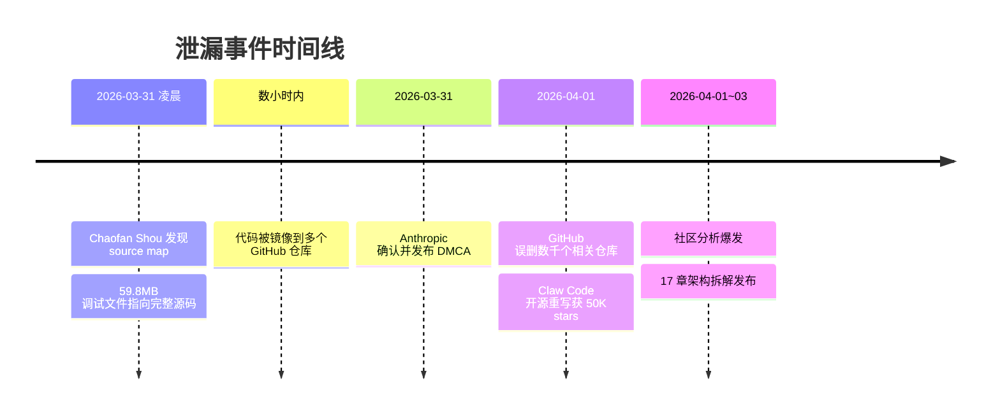
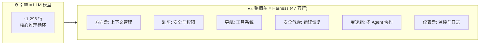
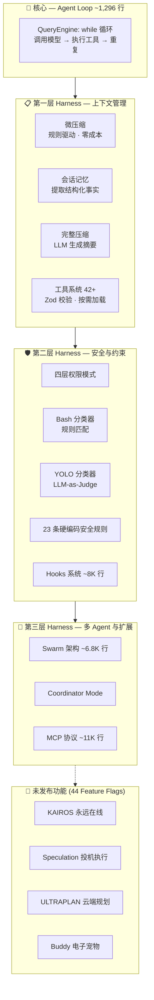
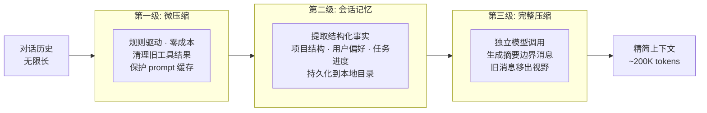
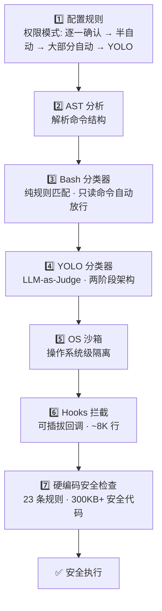
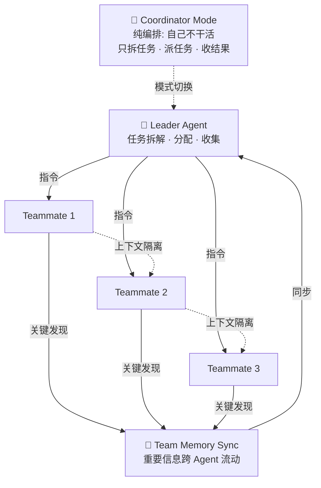

# 拆解最强 AI Agent 的设计哲学：512,000 行泄漏源码告诉我们，Claude Code 到底在造什么？

> **系列说明**：这是「从 [Claude Code](/zh/blog/9-principles-writing-claude-code-skills) 泄漏源码学 Agent 工程实践」系列的第 1 期。整个系列共 6 期，我们不只拆代码，更提炼每个 AI builder 都能带走的设计方法论。

2026 年 3 月 31 日凌晨，一件事让整个 AI 工程社区震动了。

Anthropic 在发布 Claude Code v2.1.88 的例行 npm 更新时，把一个 59.8MB 的 source map 调试文件打包进了公开包里。安全研究员 Chaofan Shou 在凌晨 4:23 发现了它——这个文件指向一个未加保护的 zip 归档，里面装着 Claude Code 的完整源码。

数小时内，代码被镜像到数十个 GitHub 仓库。社区开始疯狂分析。一个叫 Claw Code 的开源重写项目在两小时内拿到了 50,000 颗 GitHub Star——很可能是平台历史上增长最快的仓库。

泄漏的规模超出预期：**1,902 个文件，477,439 行 TypeScript 代码，42+ 内置工具，44 个未发布的 feature flags**。

但泄漏本身不是重点。重点是：**这是我们第一次能完整看到，一个年收入超 10 亿美元、全球使用率最高的 AI [coding agent](/zh/blog/coding-agents-reshaping-epd) 内部到底长什么样。**

## 一个先亮出来的核心结论

在花了大量时间研究这份源码之后（我们参考了 openedclaude 的 17 章架构拆解、Deep-Dive-Claude-Code 的 13 章分析，以及多位独立研究者的成果），有一个结论越来越清晰：

**Claude Code 的核心竞争力不在模型，在模型周围那套精密的控制系统。**

这不是客气话，而是可以用代码行数验证的事实。

Claude Code 最大的单一模块是 Query Engine（查询引擎），46,000 行代码。但它的核心逻辑——就是那个让 Claude "思考"的部分——实际上只有大约 1,296 行。剩下的 45,000 行在干什么？在处理流式传输、错误恢复、缓存管理、权限检查、上下文组装。

Tool System（工具系统）的基础定义有 29,000 行。Bash 安全相关的代码超过 300KB。权限管道 9,500 行。插件系统 18,800 行。

一句话：**Claude Code 用了不到 2,000 行让模型"思考"，用了超过 470,000 行让模型的思考变得可靠、安全、可控。**

如果把模型比作引擎，那 Claude Code 的这 47 万行代码就是整辆车——底盘、刹车、方向盘、安全气囊、导航系统。引擎一样的情况下，谁的车造得好，谁就跑得快。

这套"车身"在 AI 工程领域有一个专业名称：**Harness**（线束/控制系统）。这个词精确地描述了它的本质——不是让模型更聪明，而是给模型套上缰绳，让它的能力变得可用、可靠、可控。

对于每个正在做 agent 产品的 builder 来说，这可能是 2026 年最重要的认知：**你的竞争壁垒不在于用了哪个模型，而在于你在模型周围构建了什么样的 Harness。**

## Claude Code 的架构骨架：一个循环 + 三层 Harness

理解 Claude Code，先从它的最核心开始。

### 核心：一个 while 循环

Claude Code 的"大脑"在源码里叫 `QueryEngine`。它的核心逻辑简单到让人意外：

1. 用户输入一句话
2. QueryEngine 组装系统提示词
3. 调用模型 API
4. 如果模型说"我要用某个工具"→ 执行工具 → 把结果喂回去 → 回到第 3 步
5. 如果模型说"我完成了"或者触发了预算上限 → 结束

没有复杂的状态图，没有条件路由，没有 DAG 编排器。核心就是一个 while 循环：调用模型 → 执行工具 → 再调用模型 → 再执行工具……直到完成。

openedclaude 的分析把它描述为一个"12 步状态机"，但本质上依然是循环。这证实了一个在 agent 工程领域越来越清晰的共识：**最好的 agent 架构不是最复杂的，而是最简单的核心 + 最精密的周边。**

但这个"简单"的循环周围，包裹着一整套精密的 Harness 系统。**这才是 Claude Code 真正的竞争力所在。**

我把这套 Harness 拆成三层来讲。

### 第一层 Harness：上下文管理 — 解决"模型该看什么"

> **对 Builder 的启示**：上下文窗口是 agent 产品最稀缺的资源。关键不是装不装得下，而是该不该装进去。

如果你只能从 Claude Code 学一样东西，学这个。

Context engineering（上下文工程）是 Claude Code 里工程含量最高的部分，也是 2026 年 agent 产品最被低估的核心能力。

Claude Code 的上下文管理包含两个子系统：**压缩流水线**和**智能加载**。

**三级压缩流水线**

上下文窗口有限（约 200K tokens），但用户的对话可以无限长。Claude Code 设计了三级压缩来应对：

**第一级：微压缩**。不调用模型，纯规则驱动，成本几乎为零。它按工具类型白名单，保留最近 N 个工具结果，把更早的结果清理掉。但清理方式有讲究——它会判断 Anthropic 服务端的 prompt 缓存是否还有效，如果缓存在，就走精细路径（通过 cache editing API 删除旧结果但不破坏缓存前缀）；如果缓存过期了，就直接替换成占位符。光这一个微压缩，源码里就有三条执行路径和两种清理策略。

**第二级：会话记忆压缩**。它不做"对话摘要"，而是从对话中**提取结构化事实**——项目结构、用户偏好、任务进度——然后持久化到本地的记忆目录。提取的是事实，不是叙事。

**第三级：完整压缩**。用一次独立的模型调用，把整段对话历史总结成一条精简的上下文边界消息。之前的消息从模型视野中移除，但 UI 层保留完整的滚动历史。

三级流水线，三个不同粒度的问题，三种不同成本的解法。微压缩去噪声，记忆压缩提事实，完整压缩清历史。

**智能工具加载**

Claude Code 内置了 42+ 工具（有些分析认为加上 [MCP](/zh/blog/claude-code-seven-programmable-layers) 扩展超过 80 个），但不是一开始就全部塞进上下文。核心工具在启动时加载，扩展工具按需加载。这正是 Anthropic 自己提出的"Skill 渐进式加载"的工程落地。

每个工具用 Zod schema 定义输入参数，模型输出的 JSON 必须通过验证才能执行。如果工具输出太大，系统不会直接截断，而是存到外部，给模型一个摘要加一个指针，让它按需取用。

**所有这些设计都指向同一个原则：上下文窗口是稀缺资源。要像管理内存一样管理 context。**

对于 builder 来说，这意味着什么？如果你在做一个 agent 产品，你可能花了 80% 的时间在调 prompt 和选模型上。但 Claude Code 用行动告诉你，最值得投入的地方可能是 context engineering——**怎么在有限的窗口里，让模型在正确的时间看到正确的信息。**

### 第二层 Harness：安全与约束 — 解决"模型不能做什么"

> **对 Builder 的启示**：Prompt 里的规则是建议，代码里的规则是法律。安全不能靠模型的"自觉性"。

Claude Code 可以直接在你的电脑上执行 bash 命令、读写文件、操作 git。这个能力极其强大，但也极其危险。

它的安全系统是怎么设计的？

**四层权限模式**

从严到松，Claude Code 提供了四种权限模式：逐一确认 → 半自动 → 大部分自动 → 完全自动（YOLO 模式）。每次工具调用都要通过一个五步评估流水线。

**双层分类器（最聪明的设计）**

权限管道中最精妙的部分是双层分类器：

第一层叫 **Bash Classifier**，纯规则匹配。分析命令内容，把只读命令（`ls`、`cat`、`git status`）自动归类为安全，直接放行。不调模型，速度极快。

第二层叫 **YOLO Classifier**（名字很随意，实现很严肃）。它是一个完整的 **LLM-as-Judge 系统**——用一个独立的模型调用来审查主 Agent 的每个操作。而且有两阶段架构：第一阶段快速判断（yes/no），放行就过；只有判断要拦截时，才进入第二阶段完整推理。这大大减少了误杀率。

错误处理策略是**宁可误杀不可放过**：解析失败、API 错误，全部默认拦截。

这个设计体现了一个 agent 工程的核心原则：**生成和评估必须分离**。主 Agent 负责"想做什么"，分类器 Agent 负责"能不能做"。两个角色，两个模型调用，互不干涉。

**硬编码安全检查**

源码里有 23 条编号的 bash 安全检查规则，防御 Zsh 花括号展开、Unicode 零宽空格注入、IFS 空字节注入等。其中至少一条来自 HackerOne 安全审计中发现的真实漏洞。加上 300KB 以上的 Bash 安全代码，这不是"加了个安全层"的水平，这是把安全当成了核心架构。

**Hooks 系统（可插拔的安全扩展）**

源码有约 8,000 行代码实现了一个 Async Hook Registry，在工具调用前后、HTTP 请求前后、模型调用前后都可以挂载回调函数。比如在 HTTP 请求前做 SSRF（服务器端请求伪造）防护。这让 Harness 的每一个组件都是可插拔的——可以像 USB 设备一样随时添加或移除安全检查，不影响核心循环。

**对 builder 来说，这一层的启示是**：如果你的 agent 产品需要执行任何有副作用的操作（写文件、发请求、操作数据库），不要靠 prompt 里写"请小心"来保证安全。你需要在代码层面建立确定性的防线。Claude Code 用了 9,500 行权限代码和 300KB 安全代码来做这件事，这说明安全不是一个 feature，而是一个 system。

### 第三层 Harness：多 Agent 与扩展 — 解决"一个模型不够用怎么办"

> **对 Builder 的启示**：规模化不是靠更大的上下文窗口，而是靠分工。

当任务复杂到一个 Agent 处理不了时，Claude Code 怎么办？

**Swarm 架构（已在使用）**

Claude Code 的多 Agent 系统叫 **Swarm**，约 6,800 行代码。架构是一个 Leader + 多个 Teammate：

- **Leader**（主 Agent）负责拆解任务、分配、收集结果
- **Teammate**（子 Agent）跑在同一个运行时里，共享权限桥接
- **上下文严格隔离**：Leader 只看到分配的指令和最终结果，Teammate 的中间过程全部隔离
- **关键发现可以跨 Agent 流动**：通过 Team Memory Sync 机制，重要发现会同步回 Leader 的记忆目录，其他 Teammate 也能看到

上下文隔离 + 关键信息同步，这个组合设计得很巧妙。它解决了 multi-agent 系统最常见的两个问题：信息爆炸（所有 agent 共享所有信息）和信息孤岛（agent 之间完全不通信）。

**Coordinator Mode（编排器模式）**

开启后，Claude Code 变成一个纯粹的任务编排器——自己不干活，只负责拆任务、派任务、收结果。它的系统提示词里有一句值得每个做 multi-agent 的人记住的话：

*"Do not say 'based on your findings'. Read the actual findings and specify exactly what to do."*

翻译成产品设计语言：**编排器不能偷懒委派，它必须理解每个子任务的结果，然后给出精确的下一步指令。** 这是"orchestrator"和"delegator"的本质区别。

**MCP 协议（万物皆可工具化）**

[Model Context Protocol](/zh/glossary/model-context-protocol)（模型上下文协议）是 Anthropic 提出的开放标准，Claude Code 用约 11,000+ 行代码实现了完整支持。MCP 的核心思想是：**任何外部服务都可以变成 Agent 可调用的工具**。GitHub、数据库、Slack、本地文件系统——通过 MCP，它们都变成了 Claude Code 的"手"。

对 builder 来说，MCP 的意义在于：你不需要为每个集成单独写代码。一个协议、一套标准，就能让你的 agent 连接到任何服务。这是 agent 生态的基础设施。

## 冰山之下：44 个 Feature Flag 藏着的未来

泄漏最让人兴奋的部分，不是 Claude Code 现在能做什么，而是它**即将能做什么**。

源码中有 44 个未发布的 feature flags——功能已经完整构建，但通过编译时宏（`feature('FLAG')`）控制，在公开版本中被关闭。每一个 flag 背后都是一个产品决策。以下是最值得关注的几个：

### KAIROS：永远在线的 AI 助手

KAIROS 不是一个功能，而是一种全新的交互范式。

当前所有 AI 工具都是"被动"的——你问一句，它答一句。KAIROS 要把 Claude Code 变成一个**永远在线的后台 daemon**。系统按固定间隔向 Agent 发送 tick 提示，Agent 自主决定要不要主动做点什么。

更有意思的是它配备了一个叫 **Dream** 的后台记忆整理引擎——空闲时自动整合和修剪记忆。白天主动行动，空闲时整理记忆。

有 15 秒阻塞预算的硬性约束，有自己的专属工具集。这是从"工具"到"同事"的转变。

### Speculation：在你按回车之前就开始干活

投机执行（Speculation）可能是最具工程想象力的功能。Claude Code 回答完你的问题后，在你还没按回车之前，系统就已经在后台开始执行它预测你会做的下一步了。

所有写入重定向到沙箱——接受就合并，拒绝就丢弃。而且一次投机完成后，立即开始下一轮。预测、执行、预测、执行，试图始终领先你好几步。

这对 builder 的启示是：**Agent 产品的终极体验不是"快速响应"，而是"提前响应"。**

### ULTRAPLAN：把深度思考搬到云端

ULTRAPLAN 把复杂的规划任务卸载到云端容器，运行 [Opus 4.6](/zh/blog/opus-4-6-1m-default-claude-code)，最长可以跑 30 分钟，用户可以通过浏览器实时观看和审批。

它和 [Manus](/zh/blog/agent-harnesses-2026) 的区别很精准：Manus 把整个执行都放云端，ULTRAPLAN 只把规划放云端，实现仍然在本地。**规划需要深度思考但不需要本地文件系统，实现需要本地环境但不需要 30 分钟推理。** 拆开放到各自最合适的地方。

### Buddy：是的，一个电子宠物

这可能是最出人意料的发现。Claude Code 内置了一个完整的类 Tamagotchi 电子宠物系统——有物种稀有度、闪光变体、程序化生成的属性，还有 Claude 在首次孵化时撰写的"灵魂描述"。

看起来荒谬？但从产品角度想想：一个开发者每天在终端里花 8 小时和 Claude Code 协作。Buddy 系统把这种冰冷的工具关系变成了一种情感连接。这是 Anthropic 在探索 **AI 工具的情感设计维度**。

### 反蒸馏防御：针对竞争对手的技术战

源码里有一个 `ANTI_DISTILLATION_CC` flag。开启后，Claude Code 会在 API 请求中注入虚假的工具定义（fake tools）。如果竞争对手在录制 Claude Code 的 API 流量来训练自己的模型，这些假工具定义会污染他们的训练数据。

还有 **Undercover Mode**——当检测到可能在第三方平台上运行时，Claude Code 会修改自身行为模式，避免暴露内部架构细节。

这两个功能揭示了一件事：**AI 产品之间的竞争已经深入到源码和 API 层面，攻防战不只在市场上，也在协议里。**

## 一些让人意外的内部数据

泄漏还暴露了一些内部信息，对理解 Anthropic 的工程现状有参考价值：

- **内部模型代号**：Capybara = Claude 4.6 的某个变体，Fennec = Opus 4.6，Numbat = 尚未发布的新模型
- **内部 benchmark**：最新 Capybara v8 的"虚假声明率"（false claims rate）为 29-30%，相比 v4 版本的 16.7% 实际上是退步的。这说明模型能力的提升并不总是线性的，有时候新版本在某些维度会倒退
- **代码的 AI 生成比例**：Anthropic 自己的统计显示，其内部约 70-90% 的代码由 Claude 编写。Claude Code 在某种程度上是一个"自己写自己"的系统
- **UI 渲染方案**：用了 React 19 + 一个被 fork 的 Ink 渲染器，管理 140+ 组件的终端 UI。用游戏引擎的思路做终端界面

## 从 Claude Code 学到的 5 条 Agent 工程原则

综合全景来看，Claude Code 的设计哲学可以浓缩为 5 条原则，每一条都可以直接应用到你自己的 agent 产品中：

**原则一：核心要简单，周边要精密**
Agent 的核心逻辑可以是一个简单的 while 循环。复杂性应该在周边系统中，而不是在核心逻辑里。Claude Code 用 1,296 行实现核心循环，用 47 万行实现周边。

**原则二：上下文是最稀缺的资源**
不要试图把所有信息塞进 [context window](/zh/blog/effective-harnesses-for-long-running-agents)。要像操作系统管理内存一样管理上下文——分层、压缩、按需加载、主动淘汰。

**原则三：安全是架构，不是功能**
权限和安全不能是事后加上的。Claude Code 把安全做成了和核心循环同级的系统——300KB 安全代码、双层分类器、23 条硬编码检查规则、可插拔的 Hooks。

**原则四：生成和评估必须分离**
一个 Agent 负责"想做什么"，另一个独立的系统负责"能不能做"。永远不要让执行者同时当裁判。

**原则五：规模化靠分工，不靠更大的窗口**
当任务太复杂时，答案不是更大的 context window，而是多个 Agent 的分工协作——上下文隔离但关键信息互通。

## 这个系列后面会讲什么

这是系列的第 1 期，全景篇。我们建立了 Claude Code 的完整认知框架，从核心循环到三层 Harness，从上下文管理到安全约束，从多 Agent 到隐藏功能。

但每一层展开讲都有太多细节值得深挖。接下来 5 期，我们会逐层拆解：

| 期数 | 主题 | 核心问题 |
|------|------|----------|
| **第 2 期** | **Agent Loop：一个循环统治一切** | 12 步状态机的每一步都在做什么？Query Engine 的 46,000 行代码怎么组织的？如何设计你自己的 agent loop？ |
| **第 3 期** | **Tool System 与安全：让 AI 安全地动手** | 42+ 工具的注册和调度机制。双层 LLM-as-Judge 的完整架构。如何为你的 agent 设计安全边界？ |
| **第 4 期** | **Context Engineering：最被低估的核心能力** | 三级压缩的源码级拆解。会话记忆的提取和持久化。如何像管理内存一样管理上下文？ |
| **第 5 期** | **Multi-Agent：从单兵作战到团队协作** | Swarm 架构的源码实现。Coordinator Mode 的编排逻辑。上下文隔离 + 记忆同步的设计哲学。 |
| **第 6 期** | **隐藏功能与未来形态：[AI Agent](/zh/blog/ivanhzhao-notion-thoughts) 要变成什么？** | KAIROS / Speculation / ULTRAPLAN / Buddy 的完整拆解。从被动工具到主动伙伴，agent 的下一个形态。 |

每一期都会保持同样的结构：先讲 Claude Code 怎么做的（架构和源码），再提炼 builder 可以带走的方法论。

---

**如果你觉得这篇有用，关注这个系列，我们下期见。**

---

---

*觉得有用？[订阅 AI 简报](/subscribe)，每天 5 分钟掌握 AI 动态。*
