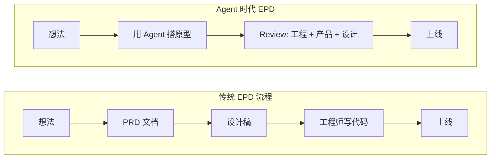

# AI编程Agent正在重塑产品工程：从PRD驱动到原型驱动的范式转移

**[LangChain](/zh/blog/agent-harnesses-2026)** CEO Harrison Chase 近期发文断言：PRD 作为软件开发起点的时代结束了。当**[AI编程](/zh/blog/claude-code-seven-programmable-layers)Agent**把代码生成成本压到趋近于零，整条产品开发流水线正在被倒过来重排——先出原型，再补文档。这篇文章拆解这场范式转移的底层逻辑，以及它对工程师、PM、设计师意味着什么。

## 发生了什么

传统软件开发遵循四步瀑布：Idea → PRD → Mock → Code。之所以这么走，是因为写代码太贵——一个功能动辄几周，必须先用文档对齐所有人，避免返工。PRD 是这条流水线的发令枪。

**[Coding Agent](/zh/blog/juliandeangelis-ai-agents-future)** 的出现打破了这个前提。Harrison Chase 的原话是："anyone can write code now"。代码成本暴跌后，越来越多团队的实际工作方式变成了 Idea 直接到 Code，三方围着可运行的原型给反馈。

Harrison Chase 画出了三个阶段的演进路径：第一阶段是传统瀑布，瓶颈在代码实现；第二阶段是当前状态，瓶颈从实现转移到了审查——谁都能用 Agent 搞出原型，Review 队列直接爆了；第三阶段是他认为的终局，Idea 同时产出 Doc + Code 的捆绑包提交 Review，文档不再是起点，而是解释意图的说明书。

他还提了一个大胆的预判：未来的 PRD，可能就是一组结构化的、有版本控制的 **Prompt**。

## EPD 工作流的变迁

## 为什么重要

这场变化最深层的影响不在流程，在人。

Harrison Chase 说得很直接：使用 AI 编程 Agent 不是建议，是要求。不用的人，会被用的人替代。原因在于 Agent 把三个角色的边界彻底模糊了——PM 可以直接搭原型，不用写完需求等排期；设计师可以在代码里迭代，不只在 [Figma](/zh/glossary/figma) 里画图；工程师可以把时间从写代码转向系统架构思考。

这就像围棋 AI 出现后的人类棋手：执行力被 AI 碾压，剩下的只有大局观和判断力。**通才变得比以前更值钱了**，因为一个能同时理解产品、设计和工程的人，省掉了三个人之间的沟通成本。以前这种人虽然厉害，但实现还是得靠团队；现在他自己跟 Agent 就能干完。

但这里有个暗面。AI 不光放大了优秀的人，也放大了糟糕的人。Harrison Chase 的比喻很精准：给所有人发了一把电锯，好木匠做家具的速度翻倍，手艺差的人制造废料的速度也翻倍。一个烂 PM 带着一个烂想法用 Agent 搭出原型，这个原型要占 Review 资源，更危险的是合并惯性——"代码都写好了，要不就上线吧？"——让产品越来越臃肿。

## 技术细节

Harrison Chase 给出了一个 2×2 矩阵来定位个人竞争力。横轴是工程能力，纵轴是产品与设计思维。

**右上角：Unicorn**——全能选手，能想、能做、能审。但他自己承认，真正的 Unicorn 极少。

对大多数人来说只有两条路：

**Builder 路线**：不需要在每个方向都顶尖，但能独立从想法走到上线。有基本的产品感觉，会用 Agent 写代码，有设计直觉。在测试套件和组件库的护栏里，能把小功能从零做到发布。

**Reviewer 路线**：在某个领域有极深的[系统思维](/glossary/system-thinking)。能一眼看出架构隐患，能快速判断产品方向对不对。但门槛极高——必须是领域内顶尖的，而且审查速度要快。

矩阵左下角写的是"Always in trouble"。既没有工程能力，也没有产品思维的人，AI 时代没有容身之处。

核心论点归结为一句话：**执行变得廉价之后，判断力才是护城河。**不管你是工程师、PM 还是设计师——工程师要有清晰的架构心智模型，PM 要能分辨用户真正需要什么而不是嘴上说的，设计师要能解释为什么某个交互就是对的。

## 你现在该做什么

1. **下次有新功能想法，别急着写文档。** 先用 [Coding Agent](/glossary/coding-agent) 花一小时搭出可运行的原型，再写一份简短的需求说明解释设计意图，用原型 + 文档的组合包发起评审。
2. **画出你在 2×2 矩阵上的位置。** 横轴工程能力，纵轴产品设计思维。然后选一个方向：要么补齐短板成为 Builder，要么在强项上做到极致成为 Reviewer。
3. **培养产品感觉。** 你现在要给 Agent 下指令，如果你告诉它造一个错误的东西，你就是在给团队制造垃圾。

PRD 没有死，死掉的是 PRD 作为起点的那套瀑布流程。文档在进化——从发令枪变成说明书，从 Word 文档变成给 AI 的精确指令。

**相关阅读**：[什么是 Coding Agent？](/glossary/coding-agent) · [Prompt Engineering 入门](/glossary/prompt-engineering)

---

*觉得有用？[订阅 AI 简报](/subscribe)，每天 5 分钟掌握 AI 动态。*
