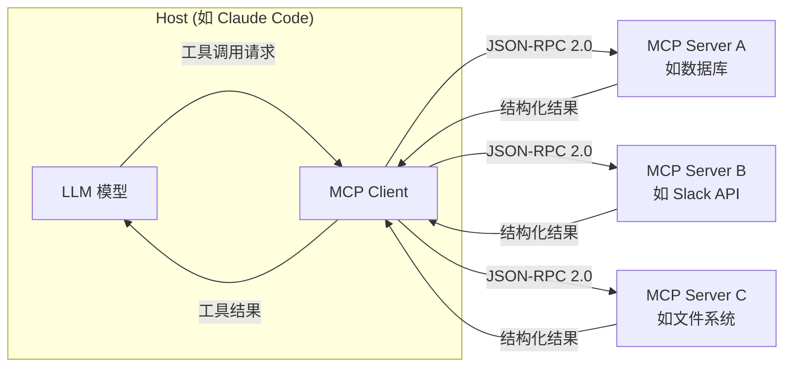

# 如何创建 MCP Server：从零开始的完整指南

**[Model Context Protocol](/zh/glossary/model-context-protocol)（[MCP](/zh/blog/claude-code-seven-programmable-layers)）** 是 Anthropic 于 2024 年 11 月发布的开源标准，专门解决 AI 模型与外部数据源、工具之间的集成问题。如果你想让 Claude、GPT-4 或其他大语言模型访问你的数据库、API 或自定义工具，创建一个 [MCP Server](/zh/blog/google-colab-mcp-server-cloud-gpu-ai-agents) 是目前最标准化的做法。

## MCP 解决了什么问题

传统的 AI 集成是 M×N 问题：M 个 AI 模型需要分别对接 N 个外部工具，每对都要写定制代码。MCP 把这个问题变成 M+N：每个 AI 实现一次 MCP Client，每个工具实现一次 MCP Server，双方通过统一协议通信。

这就是为什么它被称为"AI 的 USB-C 接口"——标准化之后，任何符合规范的 AI 都能直接使用任何符合规范的工具，不需要额外的胶水代码。

截至 2026 年初，OpenAI、[Google DeepMind](/zh/blog/gemini-3-1-pro-complex-tasks)、Microsoft、[Apple](/zh/glossary/apple) 均已接入 MCP，月 SDK 下载量超过 9700 万次。这个增长速度说明生态已经成型，现在是学习创建 MCP Server 的好时机。

## MCP 的技术架构

在动手之前，需要理解三个核心角色：

- **Host**：运行 AI 模型的应用，比如 Claude Desktop 或你自己的 AI 应用
- **Client**：Host 内部管理 MCP 连接的组件
- **Server**：你要创建的部分，暴露工具、资源或 Prompt 给 AI 使用

通信层基于 **JSON-RPC 2.0**。传输方式有两种：
- **stdio**：本地进程间通信，适合本地工具和开发调试
- **Streamable HTTP**：网络传输，适合远程服务和生产部署

对于大多数开发者来说，从 stdio 开始最简单——不需要处理网络配置，直接在本地跑起来。

## 基本 Server 实现结构

一个最小可用的 MCP Server 需要做三件事：

**1. 声明能力（Capabilities）**

Server 启动时告诉 Client 自己支持什么：工具（Tools）、资源（Resources）还是提示词模板（Prompts）。大多数场景从 Tools 开始就够了。

**2. 定义工具（Tools）**

每个 Tool 需要：名称、描述（AI 靠这个决定何时调用）、输入 Schema（JSON Schema 格式）、执行逻辑。

描述写得好不好直接影响 AI 能不能正确使用你的工具。描述要精确说明工具做什么、什么时候适合用、参数的含义。

**3. 处理请求**

实现 `tools/call` handler，接收 AI 发来的调用请求，执行逻辑，返回结果。结果可以是文本、JSON 或错误信息。

官方提供了 Python 和 TypeScript 的 SDK，两者都封装好了协议细节，你只需要关注业务逻辑。Python SDK 适合数据处理类工具，TypeScript SDK 适合前端或 Node.js 环境。

## 安全注意事项

MCP 的安全性是一个需要认真对待的话题。研究人员已经记录了几类风险：

- **Prompt Injection**：恶意数据源可以在返回内容中插入指令，欺骗 AI 执行非预期操作
- **工具滥用**：AI 可能在没有充分授权的情况下调用破坏性工具

MCP 规范包含 OAuth 2.1 授权机制，但实现细节复杂，许多早期 Server 并未完整实现。

实践建议：对写操作（数据库写入、文件删除、API 调用）加确认步骤；限制 Server 的权限范围，遵循最小权限原则；不要信任来自外部数据源的内容作为可执行指令。

## 治理与生态现状

2025 年 12 月，Anthropic 将 MCP 项目捐赠给 **Agentic AI Foundation（AAIF）**，这是 Linux Foundation 旗下新成立的组织。这意味着 MCP 不再是 Anthropic 的私有标准，而是由社区共同治理的开放协议。

对开发者来说，这个消息很重要：你现在构建的 MCP Server，未来不会因为某家公司的商业决策而失效。投入学习 MCP 的时间是值得的。

关于 [agentic coding](/glossary/agentic-coding) 的更多背景，可以参考我们的词汇解释。如果你想了解 MCP 在实际开发工作流中的位置，可以读读[为什么 Claude Code 不只是一个编程工具](/blog/claude-code-is-not-a-coding-tool)这篇文章。

## 从哪里开始

如果你是第一次接触 MCP：

1. 先读 MCP 官方规范，理解协议的设计意图
2. 用官方 Python 或 TypeScript SDK 创建一个最简单的 Tool Server
3. 用 Claude Desktop 或 MCP Inspector 测试你的 Server
4. 在本地跑通 stdio 传输后，再考虑 HTTP 部署

MCP 的学习曲线不高，但协议细节值得仔细阅读。理解 JSON-RPC 的请求/响应结构，以及 Client 如何发现 Server 的能力，会让你少踩很多坑。

---

*觉得有用？[订阅 LoreAI](/subscribe)，每天 5 分钟掌握 AI 动态。*
