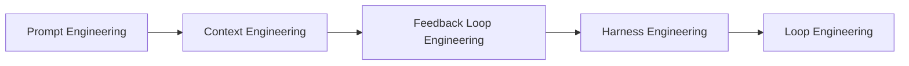

# Loop Engineering 最全指南：从写提示词到设计循环

2026年6月初，iOS 开发圈知名的"小龙虾之父" Peter Steinberger 在 X 上发了一条推文，迅速刷屏了整个AI开发者圈：

> "Here's your monthly reminder that you shouldn't be prompting coding agents anymore. You should be designing loops that prompt your agents."
>
> （提醒你：你不应该再手动提示编码智能体了。你应该设计循环来替你提示。）

但真正让这个概念有说服力的，是 [Anthropic Claude](/zh/blog/anthropic-claude-memory-upgrades-importing) Code 负责人 Boris Cherny 的一段话：

> "2023年：你写代码。2024年：你提示Claude来写代码。2025年：你写循环来提示Claude。2026年：你构建驾驭系统来运行这些循环。"

他补了一句更直白的：**"I don't prompt Claude anymore. I have loops running that prompt Claude and figuring out what to do. My job is to write loops."**（我不再提示Claude了。我有循环在运行，它们负责提示Claude并决定该做什么。我的工作是写循环。）

如果你每天在用 [Claude Code](/zh/blog/9-principles-writing-claude-code-skills)、[Cursor](/zh/glossary/cursor) 或 [Copilot](/zh/glossary/copilot)，你可能已经隐约感受到了这个转变——你花在"写提示词"上的时间越来越少，花在"搭系统"上的时间越来越多。Loop Engineering 就是对这种实践的系统化总结。

这篇文章会拆解这个概念到底是什么、怎么落地、有哪些坑。不是理论综述，而是一个已经在用AI编码工具的开发者，需要知道的下一步。

## 一、什么是 Loop Engineering

先说清楚 Loop Engineering 在整个AI开发技能演进中的位置。过去三年，我们经历了一条清晰的路径：



**[Prompt Engineering](/zh/blog/superpowers)（提示工程）**：怎么措辞你的请求。模型越来越聪明，这层的边际收益在递减。

**Context Engineering（上下文工程）**：策划模型能看到什么信息——写好 `[CLAUDE.md](/zh/blog/claude-code-memory)` / `AGENTS.md`，准备文档，组织项目结构。这层仍然重要，但它解决的是"单次调用的质量"。

**Feedback Loop Engineering（反馈循环工程）**：让智能体能自己验证工作——跑测试、查日志、检查浏览器渲染结果。我认为这是目前大多数开发者能获得最大回报的投资点——你不需要复杂的编排系统，只要让智能体能看到自己的代码跑起来是什么样，输出质量就会有质的飞跃。

**[Harness Engineering](/zh/blog/langchain-improving-deep-agents-harness-engineering)（驾驭工程）**：围绕单次智能体运行的整套系统——运行前给方向的引导器（guides），运行后给反馈的传感器（sensors）。本质上就是 **Agent = Model + Harness**。

**Loop Engineering（循环工程）**：最上层。不是运行一次智能体，而是设计一个系统来持续调度、生成、编排智能体运行。你不再是"提示的人"，而是"设计提示系统的人"。

一个直观的类比：提示工程是你手动开车，上下文工程是你设好了GPS，反馈循环工程是你加了车道偏离警告和自动刹车，驾驭工程是你设计了整个驾驶辅助系统，而循环工程——你设计的是自动驾驶的运营平台，决定什么车在什么时间跑什么路线。

综合各方表述，Loop Engineering 的定义可以概括为：

> **用系统替代你自己，成为那个提示智能体的人。你定义目标和验证标准，设计让智能体自主迭代直到完成的系统——而你的角色从"操作者"转变为"系统设计者"。**

## 二、核心架构：五大构建模块 + 状态

Addy Osmani 在他广为传播的同名文章中，将 Loop Engineering 拆解为五个构建模块加上一个贯穿性的状态层。这个拆解已经成为社区共识，下面逐一展开，并对比 Claude Code 和 [Codex](/zh/blog/codex-complete-guide) 的具体实现方式。

| 构建模块 | 作用 |
|---------|------|
| Automations | 定时触发 |
| Worktrees | 并行隔离 |
| Skills | 项目知识 |
| Plugins / Connectors | MCP 集成 |
| Sub-agents | Maker/Checker |
| State / Memory | 跨会话持久化（AGENTS.md、进度文件、Linear） |

### 1. Automations（自动化）——循环的心跳

自动化是循环的触发机制：定义一个任务、一个频率、一个运行环境，然后让智能体按节奏持续运行。

在 **Codex** 中，Automations tab 让你配置项目、提示词、运行频率和环境。结果进入 Triage 收件箱，没发现问题的运行自动归档。典型使用场景包括：每日 issue 分流、汇总 CI 失败、撰写 commit 简报、回扫上周的 bug。

在 **Claude Code** 中，有几个关键机制：

- `/loop`：让任务按节奏反复运行。
- `/goal`：设定一个目标条件（比如"test/auth 下所有测试通过且 lint 干净"），智能体会持续迭代直到条件满足。关键细节——验证是否完成的是一个独立的小模型，不是写代码的那个智能体自己。
- **Hooks**：在智能体生命周期的特定节点触发 shell 命令。

如果需要持久化运行（合上笔记本之后循环不中断），可以结合 GitHub Actions 等 CI 基础设施来实现。

### 2. Worktrees（工作树）——并行隔离

当你需要同时处理多个任务时，每个任务需要自己的代码空间，否则互相冲突。

Codex 内建了每个线程一个 worktree 的机制。Claude Code 则使用 git 原生能力：`--worktree` flag 打开独立 checkout 的会话，或者在子智能体配置中设置 `isolation: worktree`，让每个帮手智能体在隔离的 checkout 中工作，完成后自动清理。

一旦你开始并行运行多个智能体，worktree 隔离就不是可选的优化，而是防止灾难的底线。

### 3. Skills（技能）——项目知识的持久化

Skills 是一种标准化的方式来打包项目知识：一个文件夹，里面有一个 `SKILL.md` 文件存放指令和元数据，可选地附带脚本、参考资料、资产。

Claude Code 和 Codex 使用相同的格式。Codex 通过 `$skill-name` 或 `/skills` 调用，也可以在任务匹配技能描述时自动触发。

实用建议：技能的描述写得越精确、越"无聊"，自动匹配就越准。花哨的描述反而会降低触发准确率。

### 4. Plugins & Connectors（插件和连接器）——与真实世界对接

基于 MCP（Model Context Protocol）协议，让智能体能读取 issue tracker、查询数据库、调用 staging API、往 Slack 发消息。因为 Claude Code 和 Codex 都使用 MCP，为一个工具写的连接器在另一个工具里通常也能用。

### 5. Sub-agents（子智能体）——Maker/Checker 分离

这是循环质量的关键杠杆。核心思想：写代码的智能体和验证代码的智能体不应该是同一个。

在 Codex 中，子智能体以 TOML 文件形式定义在 `.codex/agents/` 目录下。在 Claude Code 中，子智能体放在 `.claude/agents/` 目录下，支持组成 agent teams 在它们之间传递工作。

> Anthropic 内部数据：**标准对话消耗 1x token，单智能体循环消耗 ~4x，多智能体系统消耗 ~15x——但多智能体在内部评估中比单智能体好了 90.2%。**

### 6. State / Memory（状态/记忆）——跨会话的持久化

智能体在单次运行结束后会遗忘一切，但代码仓库不会。State 就是那个让循环"记住"的东西——一个 markdown 文件、一个 Linear 看板、一份 `AGENTS.md` 中的进度记录。否则每次运行都是从零开始。

### Claude Code vs Codex 对照表

| 构建模块 | Claude Code | Codex |
|---------|-------------|-------|
| Automations | /loop /goal Hooks | Automations tab, /goal |
| Worktrees | --worktree, isolation: worktree | Built-in per thread |
| Skills | SKILL.md | SKILL.md, invoke via $name |
| Plugins | MCP servers + plugins | Connectors (MCP) + plugins |
| Sub-agents | .claude/agents/, agent teams | .codex/agents/ (TOML) |
| State | AGENTS.md, progress files, Linear via MCP | Markdown, Linear via connector |

### 一个完整的循环长什么样

把这六个模块组装起来，Addy 在文章中描述了一个日常开发循环的工作流：

1. 每天早上，一个 **automation** 在仓库上运行。
2. 它的提示调用一个 triage **skill**，读取昨天的 CI 失败、open issues、最近的 commits。
3. 发现的问题写入一个 markdown **state** 文件。
4. 对于每个值得处理的问题，开一个隔离的 **worktree**。
5. 一个 **sub-agent** 在 worktree 里起草修复。
6. 另一个 **sub-agent** 根据项目 skills 和现有测试审查这个修复。
7. **Connectors** 让循环自动开 PR、更新 ticket。
8. 循环处理不了的问题落入 triage 收件箱，等人来看。
9. **State** 文件记住今天试了什么、过了什么、还剩什么。
10. 明天早上，循环从昨天停下的地方继续。

这基本上就是 Boris Cherny 所说的"my job is to write loops"的具体展开——你不再逐个处理 issue，而是设计一个系统让它替你处理。

## 三、真实案例与设计原则

### 案例一：自动 PR 工作流

从 issue 到 PR 的全自动化，是循环工程最典型的落地场景。

工作流是这样的：每天早上 automation 触发，triage skill 扫描昨天的 CI 失败和 open issues。对于每个可以自动处理的问题，在隔离的 worktree 里起草修复。一个子智能体写代码，另一个子智能体运行测试并审查。通过 MCP connector 自动开 PR、更新 ticket。如果 CI 全绿，PR 进入人类审查队列。如果某一步失败——写入 state 文件，留给明天或者交给人。

这个工作流的关键在于 `/goal` 的设计方式。你不是告诉智能体"修复这个 bug"，而是告诉它"运行到 `test/auth` 下所有测试通过且 lint 干净"。它会自己决定尝试什么路径、失败后怎么调整。而判断"是否达成目标"的是一个独立的小模型——不是那个写代码的智能体自己。

### 案例二：三智能体 Bug 修复循环

Anthropic 在他们的工程博客中分享了一个更精细的多智能体案例。他们用 GAN（对抗生成网络）的思路设计了三个角色：

- **Planner**：接收一个 1-4 句话的问题描述，扩展成完整的修复方案。Planner 被明确限定只关注"做什么"，不涉及具体实现细节——因为如果 Planner 在技术细节上犯了错，错误会向下游级联传播。
- **Generator**：按方案逐步实现修复。完成后进行自评估，做出一个战略性决策：如果分数趋势向好则继续优化当前方向，如果方向本身有问题则果断推翻重来。
- **Evaluator**：通过 Playwright MCP 像真实用户一样操作应用——点击 UI、测试 API endpoint、检查数据库状态。对每个维度打分，任何一个维度低于阈值则整轮失败，反馈回 Generator 重做。

Evaluator 的厉害之处在于它能发现非常具体的 bug。Anthropic 展示了 Evaluator 捕获的真实问题：比如"矩形填充工具只在拖拽起止点放置了 tile，没有填充整个区域——`fillRectangle` 函数存在但在 `mouseUp` 时没有被正确触发"；再比如"`PUT /frames/reorder` 路由定义在 `/{frame_id}` 之后，FastAPI 把 'reorder' 当作 frame_id 整数解析，返回 422"。

这种级别的精确反馈，靠模型自我批评是得不到的。用 Anthropic 原文的说法——让模型评判自己的工作，它会"自信地称赞自己的工作，即使质量明显平庸"。

### 从案例中提炼的四条设计原则

**原则一：自验证（Self-verification）**

智能体必须能端到端地验证自己的工作——跑测试、跑 lint、跑类型检查。"我觉得改好了"不算验证，只有机器可检查的通过/失败信号才算。

**原则二：Maker/Checker 分离**

写代码的智能体和验证代码的智能体不应该是同一个。这是贯穿整个 Loop Engineering 最重要的结构性决策。

**原则三：可检查的成功标准**

评分标准必须能通过代码或命令自动验证，而且要检查正确性，不只是指标。智能体为了让测试通过可能会删掉失败的测试，为了让 lint 通过可能会用 eslint-disable 淹没代码。Lance Martin（Anthropic）说得很到位：**"Rubric design is the skill now, the model is the easy part."**

**原则四：熔断机制（Circuit Breaker）**

每个循环都必须有明确的停止条件。生产参数：最大迭代 15-25 步，超时 ~300 秒，成本预算 ~$2/次。实用技巧：对每次迭代取哈希指纹，连续 3 次相同则立刻停止。

## 四、实践指南：从零开始设计你的第一个 Loop

如果你现在还在纯手动提示的阶段，不需要一步到位搭一个完整的多智能体系统。渐进式地来。

### 第一步：用 /goal 开启你的第一个循环

在 Claude Code 里，最简单的"循环化"就是用 `/goal`。比如你在处理一个前端组件的适配问题：

```
/goal: 所有 Playwright 截图与设计稿的像素差异 < 1%，且 npm test 全部通过
```

设好目标，走开喝杯咖啡。智能体会自己修改代码、跑测试、看结果、再调整。`/goal` 的核心价值在于：它让你从"逐步指挥智能体该做什么"转变为"定义终态，让智能体自己找路"——而验证终态是否达成的是一个独立的小模型，不是执行任务的那个。

### 第二步：用 Dynamic Workflows 释放多智能体的力量

当单个 `/goal` 满足不了任务复杂度时，Claude Code 的 **Dynamic Workflows**（动态工作流）是下一个台阶。这是2026年5月随 Opus 4.8 发布的功能，目前还在研究预览阶段，但它代表了 Loop Engineering 在工具层面的最直接落地。

Dynamic Workflows 的核心思路是：**Claude 会根据你的任务动态生成一个 JavaScript 编排脚本，然后调度多达上千个并行子智能体来执行。**

触发方式有三种：在提示中说"use a workflow"，使用 `ultracode` 关键词，或者设置 `/effort ultracode` 让每个任务都自动规划工作流。

它支持六种可组合的模式：分类路由、扇出汇总、对抗验证、生成过滤、锦标赛、和循环直到完成。

> **真实案例**：Jarred Sumner 用 Dynamic Workflows 将 Bun 从 Zig 移植到 Rust——750K 行代码，数百个并行智能体协作，99.8% 测试通过，11天完成。

Dynamic Workflows 和 `/goal`、`/loop` 是互补关系：`/goal` 解决深度问题，Dynamic Workflows 解决广度问题，`/loop` 解决持续性问题。Anthropic 官方建议组合使用。

⚠️ Dynamic Workflows 的 token 消耗显著高于普通会话。建议先在小范围测试，确认效果后再扩大范围。

### 第三步：加上隔离和并行

用 `--worktree` 让多个任务在隔离的 checkout 中同时运行。一个智能体修 auth 模块的 bug，另一个在给 settings 页面加新功能，互不干扰。

### 第四步：引入 Maker/Checker 分离

在 `.claude/agents/` 里定义一个 reviewer 子智能体，让它在 maker 完成后审查输出。安全审查器关注漏洞，性能审查器关注瓶颈，规范审查器关注编码风格。

### 第五步：持久化状态

把每次运行的结果、经验、踩过的坑写入一个 state 文件（比如 `PROGRESS.md`），让下一次运行从上次的进度开始而不是从零开始。这就是 outer loop 的雏形。

### 成本控制要点

- 单智能体循环的 token 消耗约为标准对话的 **4 倍**，多智能体约为 **15 倍**。
- Prompt caching 可以让 token 成本从 $3/百万降到 $0.30/百万（**10 倍差距**）。保持 prompt 的追加式增长，不要在对话中途改变 tools 列表或模型——这会破坏 cache。
- Anthropic 的三智能体 harness 单次运行成本在 $125-200 区间。但这是生成完整应用的场景。日常 bug 修复循环的成本应该在 $2 以内。
- 设好 token 预算上限。

### 常见陷阱

- **工具太多、描述模糊**：如果一个人类工程师都说不清在给定场景下该用哪个工具，智能体也不可能做对。少而精的工具集远好于大而全的工具库。
- **错误吞掉而不是暴露**：工具应该返回错误字符串而不是抛异常。异常会中断循环，而错误字符串让模型有机会自纠错。
- **删除失败的痕迹**：保留失败的行动在上下文中可见，这样模型才知道不要重复同样的尝试。擦除失败等于擦除证据。

## 五、边界与警告

Addy Osmani 在他的文章结尾给出了三条警告，值得每个开始做 Loop Engineering 的人记住：

**验证仍然是你的责任。**智能体说"done"只是一个声明，不是一个证明。循环跑完、CI 全绿、PR 自动开了——这些都不代表代码是对的。它们只代表你设定的检查通过了。而你的检查可能不够好。

**理解力债务在加速积累。**循环越快地交付你没写过的代码，你的代码库中"存在但你不理解"的部分就越大。

**认知投降是舒适的陷阱。**如果你设计循环是出于工程判断，这是进步；如果你设计循环是为了回避思考，这是灾难的序曲。

> "Build the loop. But build it like someone who intends to stay the engineer, not just the person who presses go."
>
> ——建造循环，但要以一个打算继续当工程师的人的姿态来建造。

## 结语

Loop Engineering 不是一个全新的发明——它是过去三年 AI 编码实践自然演进的结果。从写提示词，到管理上下文，到构建反馈循环，到设计驾驭系统，到最终设计运行这一切的系统。每一步都是把更多的"重复性判断"交给机器，把更多的"系统性设计"留给人。

如果你今天还在每次打开 Claude Code 都从头写提示词，试试 `/goal`。如果你已经在用 `/goal`，试试 Dynamic Workflows。如果你已经有了多智能体系统，试试把它变成一个每天自动运行的 automation。

不需要一步到位。循环的美妙之处在于——它就是为了迭代而设计的。

而随着 Fable 5 的发布——一个在自纠错、长时运行和跨会话记忆方面都有显著飞跃的模型——Loop Engineering 的可能性还在加速扩大。但那是下一篇文章的话题了。

---

**参考来源：**

- Addy Osmani, "Loop Engineering", June 7, 2026
- Anthropic, "Harness design for long-running application development", March 24, 2026
- Anthropic, "A harness for every task: dynamic workflows in Claude Code", May 28, 2026
- OpenAI, "Unrolling the Codex agent loop", January 23, 2026
- Lance Martin, "Designing loops with Fable 5", June 2026

---

*觉得有用？[订阅 AI 简报](/subscribe)，每天 5 分钟掌握 AI 动态。*
