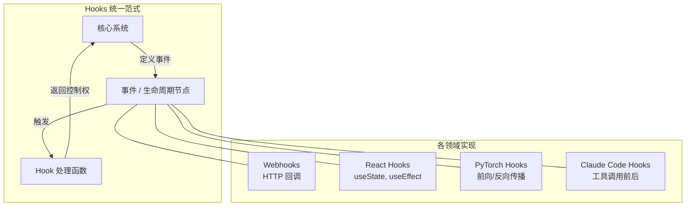

# 为什么要用 Hooks？从 Webhook 到 React、AI Agent 的统一范式

软件工程里有个词反复出现：**Hooks**。Webhook、React Hooks、PyTorch Hooks、Git Hooks、Claude Code Hooks——名字一样，场景各异，但背后逻辑惊人地一致：**在不修改核心结构的情况下，拦截、增强或响应特定事件**。

理解 Hooks 为什么重要，先要理解它解决了什么问题。

## 轮询的代价：为什么"推送"比"拉取"好

2007 年，开发者 Jeff Lindsay 提出了 Webhook 这个概念。在此之前，两个系统要同步数据，只能靠轮询（polling）：服务 A 每隔几秒问服务 B"有新数据吗？"。这种方式资源消耗高、延迟不稳定，且大量请求都是无效的。

Webhook 把逻辑倒过来：服务 B 发生事件时，主动推送通知给服务 A。这就是事件驱动架构的核心——**只在有事发生时才行动**，而不是持续消耗资源等待。

这个思路影响深远，后来被 React、PyTorch、AI 工具链反复借鉴。

## React Hooks：解决类组件的根本问题

2018 年 10 月，React 官方在 React Conf 上发布了 Hooks（React 16.8）。这不是语法糖，而是对类组件（class component）架构的根本性修正。

类组件有三个长期存在的痛点：

1. **状态逻辑难以复用**：相关逻辑分散在 `componentDidMount`、`componentDidUpdate`、`componentWillUnmount` 等生命周期方法里，跨组件共享需要高阶组件或 render props，层层嵌套导致"wrapper hell"
2. **组件臃肿**：一个复杂组件里，不相关的逻辑混在同一个生命周期方法中
3. **`this` 的困境**：JavaScript 的 `this` 绑定规则对人和编译器都不友好

`useState`、`useEffect`、`useContext` 这些 Hook 让函数组件具备了完整的状态管理能力，同时让相关逻辑聚合在一起，而不是按生命周期分散。

值得注意的是，React Hooks 的引入也带来了新的学习曲线——`useEffect` 的依赖数组、闭包陷阱、竞态条件调试，社区对此讨论至今。工具改变了范式，但没有消除复杂度，只是将它转移了。

## PyTorch Hooks：给神经网络装"探针"

机器学习框架里，Hooks 解决的是另一类问题：**如何在不修改模型结构的情况下，观察中间层的计算过程？**

PyTorch 的 `register_forward_hook` 和 `register_backward_hook` 允许开发者在前向传播或反向传播时，拦截指定层的输入和输出。这对于：

- 调试梯度消失问题
- 可视化激活层（activation maps）
- 记录训练指标

……都是非侵入式的关键工具。不需要改动模型代码，只需"挂上"一个 hook 函数。

不过，PyTorch 的 Hook 文档质量一直被社区批评为"严重不足"——功能强大，但使用门槛偏高。

## Claude Code Hooks：给 AI Agent 加上确定性约束

最近一个值得关注的应用场景：[Claude Code 的 Hooks 系统](/glossary/what-are-claude-code-hooks)。

LLM 本质上是非确定性的——同样的提示，不同时刻可能产生不同输出。这在自动化工程流程里是个问题：你无法保证 AI 每次都遵循安全规则、代码风格或上下文限制。

[Claude Code 的 Hooks](/glossary/how-hooks-work) 通过在特定事件点（如工具调用前、响应生成后）注入确定性逻辑来解决这个问题。它让开发者可以：

- 在 AI 执行破坏性操作前强制确认
- 自动注入项目上下文（如 CLAUDE.md 内容）
- 记录所有 AI 操作用于审计
- 拦截违反安全策略的命令

这与 Git Hooks 的逻辑完全一致：`pre-commit` 在提交前运行检查，不通过则阻止提交。AI Agent 的 Hooks 在工具执行前运行检查，不通过则阻止操作。

更多实战用法可参考：[Claude Code Hooks 实战指南](/blog/claude-code-hooks-mastery)。

## Hooks 的共同本质

回顾这几个场景，Hooks 的价值可以归结为三点：

**1. 关注点分离**：核心逻辑不需要知道"谁在监听它"，监听者也不需要修改核心逻辑。

**2. 非侵入式扩展**：在不 fork、不重写的前提下，给已有系统添加新行为。

**3. 事件驱动优于轮询**：只在需要时触发，而不是持续消耗资源等待。

无论是 1990 年代的 Web 回调、2018 年的 React 函数组件，还是 2025 年的 AI Agent 工具链，这个范式都在重复证明自己的价值。

理解了为什么要用 Hooks，才能在具体场景里用对它——而不是把它当成"新语法"死记硬背。

---

*觉得有用？[订阅 LoreAI](/subscribe)，每天 5 分钟掌握 AI 动态。*