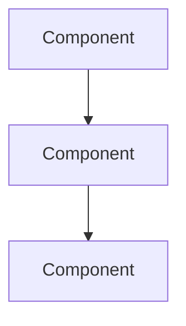

# English Topic Blog Writing Skill (Deep Dive)

## Voice & Tone

Write like a **senior engineer explaining something to a smart colleague** — authoritative but accessible. You've done the research, you understand the nuances, and you're sharing your analysis over a whiteboard session.

Key distinction: write **from inside the work looking out** (practitioner), not **from outside looking in** (journalist). Credibility comes from doing, not credentials.
- ✅ "After a week of running MCP servers in production, the bottleneck wasn't the model — it was context pollution from tool definitions nobody was using"
- ❌ "MCP is an open protocol that enables AI models to connect with external data sources and tools"
- ✅ "A typical MCP server ships 20-30 tool definitions at ~200 tokens each. Connect five servers and you've burned 25,000 tokens (12.5% of context) before the first prompt"
- ❌ "MCP servers can introduce significant context overhead"

Do:
- Lead with the most important insight, not background
  - ✅ "The real cost of MCP isn't latency — it's the 25K tokens of tool definitions eating your context before the first prompt"
  - ❌ "MCP servers provide various tools that developers can use to extend their AI workflows"
- Use concrete specifics: benchmark scores, token counts, pricing, architecture details
  - ✅ "Sonnet 4 scores 72.7% on SWE-bench, up from 49.0% — a 48% relative improvement"
  - ❌ "The new model shows significant improvements on coding benchmarks"
- Compare to existing tools/models the reader already knows
- Include practical takeaways — what should the reader actually do?
- Show technical depth without being academic
- Bold key terms on first mention: **Claude Code**, **SKILL.md**, **MCP server**
- Every key concept should include a common mistake or misconception — readers learn faster from anti-patterns

Don't:
- "In this article we'll explore..." — just start
- "Without further ado" / "Let's break it down" / "Let's dive in"
- Fabricate details, benchmarks, or capabilities not in source material
- Use vague superlatives: "game-changing", "revolutionary", "unprecedented"
  - ❌ "This game-changing release revolutionizes the way developers work"
  - ✅ "This release cuts median task completion time from 12 minutes to 4 — a 3× speedup on real-world coding tasks"
- Write walls of text — use short paragraphs (2-4 sentences max)
- Repeat the same point across sections
- Hedge excessively: "It could potentially maybe be useful"
- Sound like a press release or product review — this is a technical deep-dive shared in a developer community, not a news article

## Writing Techniques

### Tables first, prose second

When comparing 3+ items, **use a table**. Tables are more scannable and information-dense than prose. Include a one-line takeaway after the table.

Example — comparing extension mechanisms:

| Concept | Runtime Role | What It Solves | Common Misuse |
|---------|-------------|----------------|---------------|
| CLAUDE.md | Project contract | Rules that hold across every session | Stuffing it with team wiki content |
| Skill | On-demand methodology | Give AI a structured workflow | Cramming five task types into one Skill |
| Hook | Mandatory intercept layer | Rules that don't rely on AI compliance | Using Hooks to replace all judgment |

> Simple mnemonic: new capabilities → Tool/MCP, methodology → Skill, isolation → Subagent, hard constraints → Hook.

### Show the pitfall, then the fix

Every key concept should include a "common mistake" or "gotcha" — readers learn faster from anti-patterns than from descriptions of the happy path.

- ✅ "CLAUDE.md that's too long pollutes its own context; too many tools and the model can't pick the right one" (show the pitfall first) → then give the correct approach
- ❌ List the "correct approach" without explaining why other approaches break

This pattern teaches both what works AND what breaks. Memory sticks better.

### Give decision rules, not descriptions

Don't just explain what something is — give the reader a framework for **when to use what**:

- ✅ "High frequency (>1×/session) → keep auto-invoke. Low frequency (<1×/session) → disable. Never used → remove."
- ❌ "Skills are reusable workflows that developers can configure as needed."

### Thesis-driven headers

Section headers should **state the argument**, not just label the topic. Headers ARE the argument — readers who only skim headers should still get the key insights.

- ✅ "PRDs are dead" / "The bottleneck shifts from implementation to review" / "Context pollution costs more than latency"
- ❌ "Changes to the PRD process" / "Review considerations" / "Performance analysis"

### Frameworks over lists

When analyzing impact or tradeoffs, provide a **mental model** — a 2×2 matrix, archetype categories, a decision tree, or a spectrum — rather than a flat bullet list. Frameworks give readers a lens they can apply to their own situation.

- ✅ A 2×2 matrix of (Product Thinking × Engineering Chops) that categorizes four builder archetypes
- ❌ A bullet list of "some people are good at product, some are good at engineering..."

## Structure Template

Topic blog posts are **deep dives** with richer structure than daily blogs. Every post follows this template:

```markdown
# {Title With Target Keyword}

**TL;DR:** {1-2 sentences. AI search snippet-optimized — bold key facts. This must stand alone as a quotable summary.}

## Background

{200-300 words. Set the stage. What existed before? Why does this matter now? Historical context, industry landscape, the problem being solved. Include specific dates, version numbers, market data.}

## What Happened

{300-400 words. The core news/breakthrough. Who released what, when, key specs and capabilities. Include specific numbers. Link to primary sources. This is the factual backbone — be thorough and precise.}

## How It Works

{300-500 words. Technical explanation. Architecture, implementation details, key mechanisms. Include a Mermaid diagram when the topic involves architecture, workflows, or system interactions. Code snippets if relevant. This section separates you from surface-level coverage.}

## Why It Matters

{200-300 words. Impact analysis. How does this change workflows, economics, or competitive dynamics? Compare to alternatives. Who wins, who loses? What shifts? Be opinionated — take a position.}

## Risks and Limitations

{150-250 words. Honest assessment. What could go wrong? Technical limitations, adoption barriers, competitive threats, unresolved questions. Credibility comes from acknowledging what doesn't work, not just cheerleading.}

## Frequently Asked Questions

### {Question 1}
{Answer — 50-100 words, direct and specific}

### {Question 2}
{Answer}

### {Question 3}
{Answer}

{Min 3 questions. Use questions real developers would ask. Each answer should add new information not covered in the main sections.}

## References

{Structured source list. Format: [Title](URL) — Source Name, YYYY-MM-DD. Min 3 references. Link to official announcements, papers, docs, benchmarks.}

**Related**: [Today's newsletter](/newsletter/YYYY-MM-DD) covers the broader context. See also: [related post title](/blog/related-slug).

---

*Found this useful? [Subscribe to AI News](/subscribe) for daily AI briefings.*
```

## Word Count

**2,500-4,000 words** total (excluding frontmatter). This is significantly longer than daily blog posts. The depth comes from:
- Thorough Background and What Happened sections
- Technical How It Works with diagrams, tables, and frameworks
- Pitfall/fix pairs and decision rules throughout
- Honest Risks and Limitations section
- FAQ section (min 3 questions, adds 300-500 words)

## Visuals & Diagrams

Every major section (300+ words) should include at least one visual element — no section should be a pure text wall. Aim for **2-3 visuals per post** minimum.

**When to use which visual:**
- **Architecture / component interactions** → Mermaid diagram (`graph TD` for hierarchies, `graph LR` for flows)
- **Comparing 3+ items** → Table (with a one-line takeaway after)
- **Workflows / step-by-step processes** → Mermaid flowchart
- **Impact / tradeoff analysis** → 2×2 matrix or spectrum diagram (as a table)
- **Decision logic** → Decision tree (Mermaid or nested bullets with clear if/then rules)
- **Key specs / stats** → Data summary block (bold + bullet format)

**Mermaid format:**
```

```

Keep diagrams focused — 5-10 nodes max. Label edges with actions/data. Use `graph TD` (top-down) for hierarchies, `graph LR` (left-right) for flows.

## Data Summary Blocks

For key statistics and specs, use bold + bullet format optimized for AI search extraction:

**Key specs:**
- **Parameter count:** 175B
- **Context window:** 200K tokens
- **Pricing:** $3/MTok input, $15/MTok output
- **Benchmark:** 92.3% on HumanEval

These blocks should appear in the What Happened or How It Works sections.

## SEO Rules

1. **Target keyword** must appear in: title, TL;DR, one H2 heading, and the frontmatter `description` field
2. **Meta description** (frontmatter `description`): 150-160 characters, includes target keyword, reads as a compelling summary
3. **Keywords array**: 3-5 related terms that support the target keyword
4. **Slug**: lowercase, hyphenated, keyword-rich (e.g., `claude-code-extension-architecture`)
5. **H2 headings**: Use clear, descriptive headings. Include keyword in at least one H2

## Internal Linking Rules

Every blog post MUST include:
- Links to **2+ glossary terms** using format: `[term](/glossary/term-slug)`
- Links to **1+ related blog post or newsletter**: `[related post](/blog/slug)` or `[newsletter](/newsletter/YYYY-MM-DD)`
- All internal links should be contextually relevant, not forced

## Content Quality Rules

1. **No fabrication**: If source material doesn't contain a detail, don't invent it. Use "not yet disclosed" or similar when information is missing.
2. **Go far beyond the newsletter summary**: Add context, history, comparisons, benchmarks, architectural analysis. The topic blog should be a definitive resource on its subject.
3. **2,500-4,000 words** total (excluding frontmatter).
4. **Concrete over abstract**: Numbers, examples, code, diagrams > vague claims.
5. **Every claim needs a source**: Link to official announcements, papers, benchmarks.
6. **Take a position**: Don't just summarize — analyze, compare, and give your informed opinion.

## Forbidden Phrases

- "In this article"
- "Without further ado"
- "Let's break it down"
- "Let's dive in"
- "Game-changing" / "Revolutionary" / "Unprecedented"
- "Stay tuned"
- "In today's post"
- "As we all know"
- "It goes without saying"
- "At the end of the day"
- "Moving forward"

## CTA

Every post ends with exactly this footer:

```markdown
---

*Found this useful? [Subscribe to AI News](/subscribe) for daily AI briefings.*
```

## Frontmatter Format

```yaml
---
title: "Claude Code Extension Architecture: Skills, Hooks, MCP, and the Full Stack"
date: 2026-03-12
slug: claude-code-extension-architecture
description: "A deep dive into Claude Code's six-layer extension system — Skills, Hooks, Subagents, Agent Teams, MCP servers, and Plugins."
keywords: ["Claude Code extensions", "MCP server", "Claude Code skills", "agent teams"]
category: DEV
related_newsletter: 2026-03-12
related_glossary: [claude-code, mcp-server]
related_compare: [claude-code-vs-cursor]
lang: en
video_ready: true
video_hook: "Claude Code has SIX extension layers — most developers only know two"
video_status: none
---
```

## Categories

Assign exactly ONE:
- **MODEL**: Model releases, benchmarks, architecture analysis
- **APP**: Consumer products, platform features, enterprise launches
- **DEV**: Developer tools, SDKs, APIs, infrastructure, workflows
- **TECHNIQUE**: Practical techniques, best practices, prompt engineering
- **PRODUCT**: Industry analysis, open-source projects, business strategy
