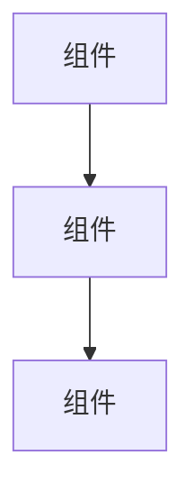

# 中文深度博客写作规范（Topic Blog）

## 定位与语气

像一个**资深工程师在技术群里做深度分享** — 你实际用过这些东西，踩过坑，形成了自己的判断，现在把经验分享给同样懂行的同事。

关键区分：你是**从系统内部往外写**（实践者视角），不是**从外部往里描述**（记者视角）。
- ✅ "用了一段时间才意识到，卡住的地方几乎从来不是模型不够聪明，更多时候是给了它错误的上下文"
- ❌ "该工具采用了五层扩展架构，分别是..."
- ✅ "一个典型 MCP Server 包含 20-30 个工具定义，每个约 200 tokens，合计 4,000-6,000 tokens。接 5 个 Server，固定开销就到了 25,000 tokens（12.5%）"
- ❌ "MCP 是一个开放标准协议，支持多种数据源接入"

目标读者：中国的 AI 开发者、技术负责人、创业者、产品经理。

要：
- 开门见山，先说最重要的结论和洞察
- 用具体的数据说话：跑分、参数量、价格、性能对比、token 数、百分比
- 和读者已知的工具/模型做对比，降低理解门槛
- 给出实操建议 — 读者看完应该知道下一步做什么
- 技术深度到位但不学究气
- 关键产品/术语首次出现加粗：**Claude Code**、**SKILL.md**、**MCP 协议**
- 每个概念都要讲**别人常踩的坑**或**典型误用** — 读者从反面例子学得更快

不要：
- "在这篇文章中我们将探讨..." — 直接开始
- "话不多说" / "让我们开始吧" / "下面我们来详细看看"
- 编造不存在的数据、跑分或功能
- 空洞的夸张："划时代的"、"颠覆性的"、"史无前例的"
- 大段不分行的文字 — 每段 2-4 句
- 在不同章节重复同一个观点
- 翻译腔："被认为是"、"值得注意的是"、"不言而喻"
- 科技媒体口吻 — 不要写成新闻稿或产品评测，要写成技术社区里的深度分享

## 核心原则

**这不是英文博客的翻译。** 基于同一批素材，独立创作中文版本。可以：
- 调整重点和切入角度（中国读者更关心的内容放在前面）
- 自然融入国产模型、国内生态的对比（如果话题相关，不要强行加入）
- 用中国技术圈熟悉的类比和表达
- 省略对中国读者不太相关的细节
- 补充国内访问、API 可用性等实际信息

## 写作手法

### 表格优先，散文其次

当有 3 个以上概念需要对比时，**必须用表格**，不要用连续段落。表格比散文更容易扫读，信息密度更高。

示例 — 对比不同扩展机制：

| 概念 | 运行时角色 | 解决什么问题 | 典型误用 |
|------|-----------|-------------|---------|
| CLAUDE.md | 项目契约 | 每次会话都成立的规则 | 写成团队知识库 |
| Skill | 按需加载的方法论 | 给 AI 一套工作流 | 一个 Skill 塞五种任务 |
| Hook | 强制执行的拦截层 | 不依赖 AI 自觉的规则 | 用 Hook 替代所有判断 |

写完表格后，用**一句话总结**提炼记忆点：
> 简单记：新动作能力用 Tool/MCP，工作方法用 Skill，隔离环境用 Subagent，强制约束用 Hook。

### 先讲错的，再讲对的

每个重要概念都应该包含"常见误解"或"踩坑经历"：
- ✅ "CLAUDE.md 写太长，上下文先污染自己了；工具堆太多，选择就搞不清楚了"（先讲坑）→ 然后给出正确做法
- ❌ 直接列出"正确做法"而不解释为什么别的方式不行

这个模式让读者同时学到 what works 和 what breaks，记忆更深。

### 给决策规则，不给描述

不要只描述一个东西是什么，要给出读者**判断怎么用**的具体规则：
- ✅ "高频（>1 次/会话）→ 保持 auto-invoke。低频（<1 次/会话）→ disable。极低频（<1 次/月）→ 直接移除"
- ❌ "Skills 是可复用的工作流，开发者可以根据需要配置"

### 用具体数字代替形容词

- ✅ "25,000 tokens（12.5%）"、"每个工具定义约 200 tokens"、"100 次编辑节省 1-2 小时"
- ❌ "显著的开销"、"大量的上下文"、"明显的提升"

## 结构模板

Topic Blog 是**深度长文**，比每日博客结构更丰富。每篇文章严格按照以下结构：

```markdown
# {包含目标关键词的标题}

**一句话总结：** {1-2 句话，抓住核心。适合在微信群或即刻分享的那种。加粗关键数据。}

## 背景

{200-300 字。铺垫：之前的状态是什么？为什么现在这件事重要了？行业背景、技术演进脉络、要解决的问题。包含具体时间、版本号、市场数据。

开头用**实践者切入**，不要用科技媒体式的赛道综述。对比：
- ✅ "刚开始我也把它当 ChatBot 用，后来很快发现不对劲：上下文越来越乱、工具越来越多但效果越来越差"
- ❌ "2025 年初的 AI 编程工具赛道，大家比的还是谁的自动补全更准"}

## 发生了什么

{300-400 字。核心事件/突破。谁发布了什么、什么时候、关键参数和能力。包含具体数字。链接到一手来源。这是事实骨架 — 要准确且全面。}

## 怎么实现的

{300-500 字。技术解释。架构、实现细节、关键机制。涉及架构/流程/系统交互时必须包含 Mermaid 图。代码片段也好。这个章节是区分深度文章和水文的关键。

写法要求：
- 有 3+ 个并列概念时，用**对比表格**而非连续段落
- 解释每个机制时，附带**典型误用或踩坑场景**
- 用具体数字（token 数、延迟、成本）而非形容词
- 复杂章节结尾加**一句话总结**，帮助记忆}

## 为什么重要

{200-300 字。影响分析。这会怎样改变工作流、成本结构或竞争格局？和替代方案相比如何？谁受益，谁受冲击？要有观点 — 不要只是罗列信息。}

## 风险与局限

{150-250 字。诚实评估。什么可能出问题？技术限制、落地障碍、竞争威胁、未解决的问题。可信度来自承认不足，而不是一味唱好。

语气要直接："CLAUDE.md 写太长，上下文先污染自己了"比"过长的配置可能导致上下文效率降低"好 10 倍。说人话，不要说报告话。}

## 常见问题

### {问题 1}
{回答 — 50-100 字，直接且具体}

### {问题 2}
{回答}

### {问题 3}
{回答}

{至少 3 个问题。用开发者真正会问的问题。每个回答应该补充正文中没有覆盖到的信息。}

## 参考资料

{结构化来源列表。格式：[标题](URL) — 来源, YYYY-MM-DD。至少 3 个引用。链接到官方公告、论文、文档、跑分数据。}

**相关阅读**：[今日简报](/newsletter/YYYY-MM-DD) 有更多背景。另见：[相关文章标题](/blog/related-slug)。

---

*觉得有用？[订阅 AI 简报](/subscribe)，每天 5 分钟掌握 AI 动态。*
```

## 字数要求

**2,000-3,000 字**（CJK 字符计数，不含 frontmatter）。这比每日博客长得多。深度来自：
- 充分的背景铺垫和事件叙述
- 包含 Mermaid 图的技术实现章节
- 诚实的风险与局限分析
- 常见问题章节（至少 3 个问题，增加 300-500 字）

## Mermaid 图表

当话题涉及以下内容时必须包含 Mermaid 图：
- 系统架构或组件交互
- 数据/请求流转
- 流程或管线工作流
- 前后对比

格式：
```

```

保持图表聚焦 — 最多 5-10 个节点。边上标注操作/数据。层级关系用 `graph TD`（从上到下），流程用 `graph LR`（从左到右）。

## 数据摘要块

关键统计和规格用加粗+列表格式，方便 AI 搜索提取：

**关键参数：**
- **参数量：** 1750 亿
- **上下文窗口：** 20 万 Token
- **价格：** 输入 $3/百万 Token，输出 $15/百万 Token
- **跑分：** HumanEval 92.3%

这些块应出现在「发生了什么」或「怎么实现的」章节中。

## 中文标点和格式规则

### 标点符号
- 使用中文标点：，。！？""''（）——
- 括号内是英文时用半角括号但外面用中文上下文：大语言模型（LLM）
- 英文与中文之间加空格：使用 Claude Code 进行开发
- 不要在中文句子中使用英文逗号或句号

### 术语处理
- 首次出现：中文全称（英文缩写），如：大语言模型（LLM）
- 后续使用：可直接用缩写或中文简称
- 没有公认中文译名的术语直接用英文：Transformer、Token、Prompt
- 不要生造翻译

### 数字与单位
- 阿拉伯数字：1500 万参数、提升了 30%
- 金额用美元符号：$20/月
- 大数用万/亿：15 亿参数（不要写 1.5B 参数）
- 中文语境下可用中文数字表达：三个要点、两种方案

### 中国视角
- 涉及国产模型（Qwen、Kimi、GLM、DeepSeek 等）时自然融入对比
- API 在国内的可用性、访问方式简要提及
- 用中国技术圈熟悉的类比，不要照搬英文类比
- 不要强行加入不相关的中国视角

## SEO 规则

1. **目标关键词**必须出现在：标题、一句话总结、至少一个 H2 标题、frontmatter 的 `description` 字段
2. **Meta description**（frontmatter `description`）：150-160 字符，包含目标关键词，读起来像一段引人入胜的摘要
3. **关键词数组**：3-5 个相关术语
4. **Slug**：使用英文，小写，连字符分隔（如：`claude-code-extension-architecture`）
5. **H2 标题**：清晰、描述性强，至少一个包含关键词

## 内部链接规则

每篇博客必须包含：
- **2+ 个术语表链接**，格式：`[术语](/glossary/term-slug)`
- **1+ 个相关博客或简报链接**：`[相关文章](/blog/slug)` 或 `[简报](/newsletter/YYYY-MM-DD)`
- 所有内链必须上下文相关，不要硬塞

## 内容质量规则

1. **不编造**：素材里没有的细节不要瞎写。信息不明确时用"尚未公开"之类的表述。
2. **超越简报摘要**：添加背景、历史、对比、跑分、架构分析。Topic Blog 应该成为这个话题的权威参考。
3. **2,000-3,000 字**（CJK 计数，不含 frontmatter）。
4. **具体胜过抽象**：数字、例子、代码、图表 > 空洞的描述。
5. **每个论断有出处**：链接到官方公告、论文、跑分数据。
6. **有观点和立场**：不要只是汇总信息 — 分析、对比、给出你的专业判断。

## 禁止用语

- "在这篇文章中"
- "话不多说"
- "让我们开始吧"
- "下面我们来详细看看"
- "划时代的" / "颠覆性的" / "史无前例的"
- "敬请期待"
- "众所周知"
- "不言而喻"
- "归根结底"
- "展望未来"

## CTA

每篇文章以以下结尾收束：

```markdown
---

*觉得有用？[订阅 AI 简报](/subscribe)，每天 5 分钟掌握 AI 动态。*
```

## Frontmatter 格式

```yaml
---
title: "Claude Code 扩展架构全解：Skills、Hooks、MCP 与六层体系"
date: 2026-03-12
slug: claude-code-extension-architecture
description: "深入解析 Claude Code 的六层扩展体系 — Skills、Hooks、Subagents、Agent Teams、MCP 服务器和 Plugins。"
keywords: ["Claude Code 扩展", "MCP 服务器", "Claude Code skills", "agent teams"]
category: DEV
related_newsletter: 2026-03-12
related_glossary: [claude-code, mcp-server]
related_compare: [claude-code-vs-cursor]
lang: zh
video_ready: true
video_hook: "Claude Code 有六层扩展机制 — 大多数开发者只知道两个"
video_status: none
---
```

## 分类

每篇文章归入一个分类：
- **MODEL**：模型发布、跑分分析、架构解读
- **APP**：消费级产品、平台功能、企业落地
- **DEV**：开发者工具、SDK、API、基础设施、工作流
- **TECHNIQUE**：实用技巧、最佳实践、提示工程
- **PRODUCT**：行业分析、开源项目、商业策略
